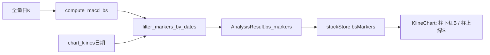

# K 线买卖点设计说明

| 项目 | 说明 |
|------|------|
| 范围 | 预测页日 K 主图 MACD 金叉/死叉 B/S 叠加 |
| 文档版本 | 1.0 |
| 编制日期 | 2026-07-23 |
| 关联文档 | [软件设计说明.md](./软件设计说明.md) · [algo API §8](./algo/api.md) |
| 非目标 | 自选迷你图、周/分钟 K、均线交叉切换、并入 fuse 权重、缠论买卖点 |

> **免责声明**：B/S 标注仅为技术指标交叉可视化，不构成任何投资建议；与融合「预测涨跌」语义解耦。

---

## 一、产品定义

对齐通达信/同花顺默认 **MACD(12,26,9)** 金叉/死叉，仅在预测页日 K 主图叠加 **B / S**，供用户对照 K 线形态。

| 项 | 约定 |
|----|------|
| 展示位置 | 预测页 `KlineChart` 主图（柱下红 B / 柱上绿 S） |
| 计算入口 | `analyze_stock` 并行路径 → `algo::bs_markers` |
| 与预测关系 | **无关**：不进 `fuse`、不影响回测方向 |
| 周期 | 仅日 K；MACD 在**全量**日 K 上计算，再按 chart 窗口过滤 |

---

## 二、选型说明（业界对照）

| 方案 | 代表 | 本工程结论 |
|------|------|------------|
| 指标交叉 BS | 同花顺/通达信；开源 STIP、easy_tdx | **采用**：规则清晰，可纯 Rust |
| 回测订单落点 | pub_finance、vnpy | 本仓已有 `BacktestRecord`，语义不同，不用 |
| 缠论买卖点 | chanlun-pro | 过重且偏 Python，与 Tauri 单进程冲突 |

---

## 三、计算口径

1. 收盘价 EMA（SMA 种子）：快线 12、慢线 26 → `DIF = EMA12 − EMA26`。
2. `DEA = EMA(DIF, 9)`（同样 SMA 种子）。
3. 相邻两根：`prev = DIF_{t-1} − DEA_{t-1}`，`curr = DIF_t − DEA_t`。
   - `prev ≤ 0` 且 `curr > 0` → **Buy（B）** 金叉。
   - `prev ≥ 0` 且 `curr < 0` → **Sell（S）** 死叉。
4. `bars.len() < 35`（`bs_markers::MIN_BARS`）→ 空列表；同日至多一个点（贴零不重复触发）。

| 常量 | 值 | 含义 |
|------|-----|------|
| `MACD_FAST` / `MACD_SLOW` / `MACD_SIGNAL` | 12 / 26 / 9 | 快线 / 慢线 / 信号线 |
| `MIN_BARS` | 35 | 最少日 K 根数 |

---

## 四、编排与数据流

**与一体化分析的关系**（`analyze_stock`）：

- K 线拉取量：`lookback + 120 + horizon`，保证 walk-forward 与 MACD 种子足够。
- chart 窗口：末尾 `max(90, lookback)` 根日 K。
- **MACD 在全量日 K 上计算**后再按 chart 日期过滤，避免 EMA 截断失真。
- 与 `predict_*` / `backtest::run_compose` 并行汇入 `AnalysisResult`。

**DTO**

- `BsMarker { date, kind: buy|sell }`
- `AnalysisResult.bs_markers` 默认空数组，兼容旧客户端

**UI**

- hover：「买入 B（MACD 金叉）」/「卖出 S（MACD 死叉）」
- 副标题有标记时附「MACD 金叉/死叉 B/S」

---

## 五、模块边界

| 层 | 职责 |
|----|------|
| `algo::bs_markers` | 纯计算：`compute_macd_bs` / `filter_markers_by_dates`（无网、无盘、无 IPC） |
| `commands::analyze_stock` | 拉全量日 K、调用 algo、按 chart 日期过滤、写入 `AnalysisResult` |
| `stockStore` / `PredictPage` | 持有 `bsMarkers`，传给 `KlineChart` |
| `KlineChart` | 主图叠加绘制 |

禁止：前端自行算 MACD 金叉死叉；禁止将 B/S 并入 `strategy` 权重或 fuse。

专项符号表见 [algo/api.md §8](./algo/api.md)。

---

## 六、相关代码

| 路径 | 职责 |
|------|------|
| `src-tauri/src/algo/bs_markers/` | MACD B/S 纯函数 |
| `src-tauri/src/commands.rs` | `analyze_stock` 编排与窗口过滤 |
| `src-tauri/src/models.rs` | `BsMarker` / `BsMarkerKind` / `AnalysisResult.bs_markers` |
| `src/types/index.ts` | 前端 DTO 对齐 |
| `src/stores/stockStore.ts` | `bsMarkers` 状态 |
| `src/pages/PredictPage.tsx` | 传入 chart |
| `src/components/KlineChart.tsx` | 主图 B/S 标注 |

---

## 七、修订记录

| 版本 | 日期 | 说明 |
|------|------|------|
| 1.0 | 2026-07-23 | 自首版从《软件设计说明》§2.11 抽离为独立设计方案 |
