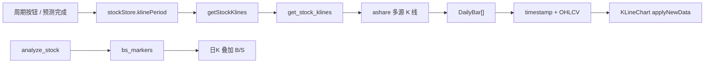

# K 线形态图设计说明

| 项目 | 说明 |
|------|------|
| 文档定位 | 独立专项：预测页历史 K 线形态图（交互、指标、周期） |
| 相关代码 | `src/components/KlineChart.tsx` · `src/stores/stockStore.ts` · `get_stock_klines` |
| 图表库 | [KLineChart](https://github.com/klinecharts/KLineChart) `klinecharts@9.8.x`（Apache-2.0） |
| 编制日期 | 2026-07-23 |

> 预测算法、回测与 MACD B/S 计算口径见 [algo](../algo/README.md) / [软件设计说明](../软件设计说明.md)。本文只描述**形态图展示层**。

---

## 1. 目标与约束

1. **交互 Canvas 图**：禁止 ``、截图或整幅静态 SVG 作为主展示；用 HTML5 Canvas 实时绘制。
2. **可缩放平移**：桌面滚轮缩放 + 拖拽平移；Android WebView 双指捏合 + 单指滑动；缩放改变可见 K 根数，非整页缩放。
3. **多周期**：`1分 / 5分 / 15分 / 30分 / 60分 / 日 / 周 / 月`，数据走已有 `get_stock_klines`。
4. **同屏组合**：主图 K + MA5/MA10/MA20；副图成交量、MACD、RSI。
5. **与预测解耦**：切周期只重拉 K 线，不强制重跑 `analyze_stock`。

---

## 2. 选型对比（摘要）

| 方案 | 渲染 | 缩放 | MA/VOL/MACD/RSI | 结论 |
|------|------|------|-----------------|------|
| TradingView Lightweight Charts | Canvas | 强 | 需自算 + 多 pane | 备选 |
| **KLineChart 9.x** | Canvas | 原生 | **内置** | **采用** |
| Apache ECharts | Canvas | dataZoom | 自拼 grid | 过重 |

采用 KLineChart 的原因：体量约 40KB gzip、零依赖、移动端手势成熟、指标开箱即用，接入成本最低。

---

## 3. 窗格布局

```text
┌─────────────────────────────────────┐
│ 周期工具条 · 最新价 · 复位视野        │
├─────────────────────────────────────┤
│ 主图：蜡烛 + MA5 / MA10 / MA20      │  ← 可缩放/平移（共用 X 轴）
├─────────────────────────────────────┤
│ 副图：VOL（成交量）                   │
├─────────────────────────────────────┤
│ 副图：MACD（DIF / DEA / 柱）         │
├─────────────────────────────────────┤
│ 副图：RSI                            │
└─────────────────────────────────────┘
```

- 副图高度可拖拽分隔条调整（库内置 `dragEnabled`）。
- A 股配色：涨红 `#f87171`、跌绿 `#34d399`，与应用暗色底一致。

---

## 4. 数据流



| 字段 | 日/周/月 | 分钟 |
|------|----------|------|
| `DailyBar.date` | `YYYY-MM-DD` | `YYYY-MM-DD HH:MM` |
| 图表 `timestamp` | 本地 0 点毫秒 | 本地时分毫秒 |

时区：`Asia/Shanghai`。

**拉取条数（前端）：**

| 周期 | limit 策略 |
|------|-----------|
| day | `max(120, lookbackDays + 30)`，保证均线与标记窗口 |
| week | 104 |
| month | 60 |
| min1 / min5 | 240 |
| min15 | 160 |
| min30 / min60 | 120 |

---

## 5. 交互约定

| 能力 | API / 行为 |
|------|------------|
| 缩放开关 | `chart.setZoomEnabled(true)` |
| 平移开关 | `chart.setScrollEnabled(true)` |
| 复位 | `scrollToRealTime()` |
| 容器尺寸 | `ResizeObserver` → `chart.resize()` |
| 触摸 | 容器 `touch-action: none`，避免页面抢走手势 |

**禁止**：主路径用 `getConvertPictureUrl` 生成图片再展示（仅分享导出可用，本期不做）。

---

## 6. MACD B/S 标记

- 来源：Rust `algo::bs_markers::compute_macd_bs`，经 `analyze_stock` → `bs_markers`。
- **仅在 `klinePeriod === "day"`** 时用自定义 overlay 画在对应 K（买：柱下 `B`；卖：柱上 `S`）。
- 分钟/周/月不画：标记口径是日线 MACD，避免误导。

---

## 7. 组件与状态

| 模块 | 职责 |
|------|------|
| `KlineChart.tsx` | init/dispose、样式、指标、overlay、周期条 UI、复位 |
| `stockStore` | `klinePeriod`、`setKlinePeriod`、`loadChartKlines`；预测完成后按需刷新图 |
| `services/api.ts` | `getStockKlines(stock, limit, period)`（已有） |

切换股票时重置周期为 `day`。

---

## 8. 验收清单

- [ ] 页面上无图片形式的 K 线主展示
- [ ] 桌面滚轮可缩放、拖拽可平移
- [ ] Android WebView 双指缩放、单指平移
- [ ] 八周期切换数据正确刷新
- [ ] 同屏可见 K + M5/M10/M20 + VOL + MACD + RSI
- [ ] 日 K 显示 B/S；其它周期不显示
- [ ] 切周期不触发整套预测重算

---

## 9. 非目标

画线工具、全量指标库、实时 tick 推送、ScenarioChart（recharts 情景路径保持独立）。
