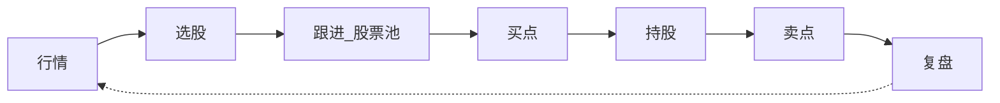
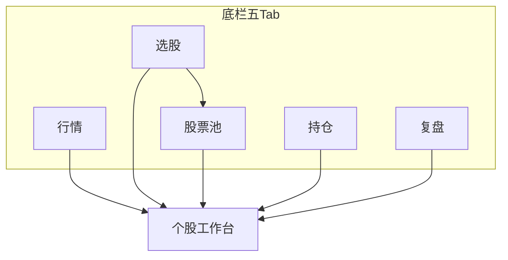
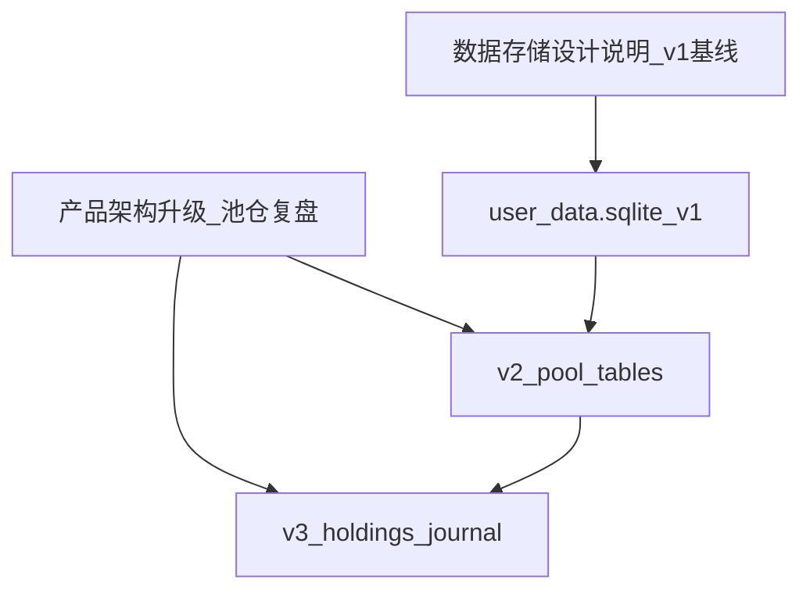
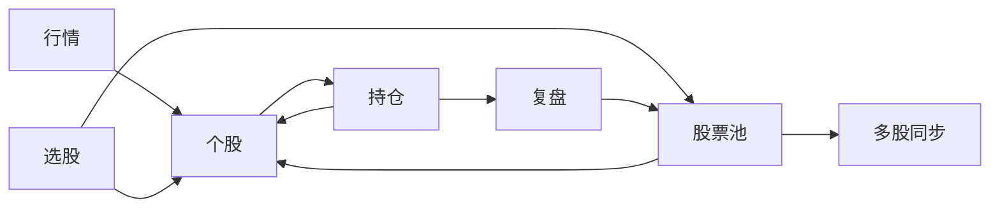
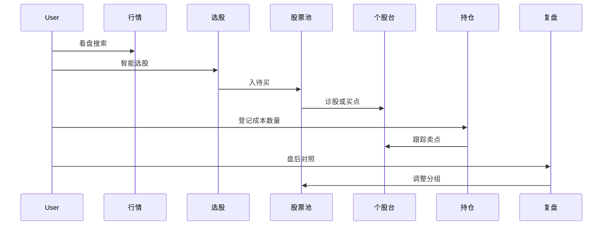

# 以太测产品架构升级方案

| 项目 | 说明 |
|------|------|
| 产品名称 | 以太测（StockPredict） |
| 文档类型 | **独立**产品架构 / 交互升级提案（非现行设计说明修订稿） |
| 文档版本 | 0.2 |
| 编制日期 | 2026-07-23 |
| 状态 | Phase A/B/C **已落地**（`feat/product-arch-upgrade`）；用户态 SQLite schema **v3** |
| 现行基线 | [软件设计说明.md](./软件设计说明.md) · **[数据存储设计说明.md](./数据存储设计说明.md)**（schema v1）及盯盘/选股/K 线等专项（本文不改写之） |

> **免责声明**：本软件预测与技术标记仅供研究演示，不构成投资建议。升级后界面须持续明示该口径。

---

## 1. 升级背景与目标

### 1.1 现行产品形态（基线摘要）

- 技术栈：Tauri 2 · React · 底栏五页（首页 / 选股 / 预测 / 自选 / 设置）。
- 能力重心：多信号组合涨跌概率、智能选股、日 K MACD B/S、回测、本地盯盘。
- 用户态：已按 [数据存储设计说明](./数据存储设计说明.md) 落在 `app_data_dir/user_data.sqlite`（B+C）；设置页可导出/导入。
- 痛点：预测页过载且易空心；自选无分组；缺持股/复盘闭环；看图在小屏易被信息挤占；文档侧栏与实现不一致。旧 localStorage 主存风险已由存储专项治理；**本架构升级须在 SQLite 基线上扩展，禁止再把池/仓/复盘写回 localStorage 主存**。

### 1.2 升级目标

1. 用 **炒股流程** 重组导航与界面，而非功能堆砌。
2. 将能力 **原子化** 后按场景组合（诊股、指标图、买卖点、多股同步、盈亏等）。
3. **自选 → 股票池**（自定义分类）；补齐 **持仓 / 复盘**（本地研究向，不接券商）。
4. 对标主流竞品交互形态，保持差异化：**可解释组合信号 + 同构回测 + 本地池/仓**。
5. **多机型适配** + **技术指标图沉浸看图** 列为硬约束。
6. 新实体一律走 `user_data.sqlite` **正向 schema 迁移**，覆盖安装不丢池/仓/复盘；导出包覆盖新表。

### 1.3 非目标（本期提案明确不做）

- 券商交易下单、成交同步、全量资讯/社区、自然语言大模型问句。
- 改动 fuse / 回测 / bs_markers **算法口径**。
- **重开存储选型**（不回到 localStorage 主存；不引入账号云同步）；沿用存储专项 **B 为主 + C 为辅**。
- 修订现行《软件设计说明》等原文（落地立项后再同步）；存储专项现行 v1 正文保持，v2/v3 DDL 以本文提案为准，落地时再回写。

---

## 2. 竞品对照

| 竞品 | 流程相关形态 | 以太测取舍 |
|------|--------------|------------|
| **同花顺** | 行情底栏 + 自选分组 + 个股内诊股/技术；选股进自选 | 学个股挂载能力、自选分组；不学全量交易 |
| **东方财富** | 轻入口、结论先行 | 学结论先行、细节折叠 |
| **新浪财经（芝麻 AI）** | 多入口 AI、白话摘要、信源可溯、自选 AI | 学多入口诊股、人话摘要、状态可溯 |
| **AI 涨乐** | 盘前/盘中/盘后意图卡 | 学时段任务组织；不单独占主 Tab |

差异化钉在：组合信号可解释、同构回测、本地股票池/持仓研究。

---

## 3. 流程主轴 × 能力原子

### 3.1 用户任务主轴



### 3.2 能力原子表

| 能力 ID | 名称 | 相对现行 | 产出形态 |
|---------|------|----------|----------|
| `quote` | 行情报价 | 已有 | 价/%/量 |
| `search` | 搜索 | 已有 | 进个股 |
| `board` | 热门/板块 | 已有 | 列表 |
| `screen` | 智能选股 | 已有 | TopN → 入池/诊股 |
| `diagnose` | 诊断预测 | 已有 | 概率+白话+信源 |
| `tech` | 技术指标/K线 | 已有 | 多周期 K + 指标 |
| `bs` | 买卖点标注 | 已有 | 图上 B/S + 列表徽标 |
| `compose` | 信号组合 | 已有 | 抽屉 |
| `backtest` | 回测 | 已有 | 准确率/记录 |
| `scenario` | 情景路径 | 已有 | 高开低开 |
| `monitor` | 盯盘 | 已有 | 规则+通知 |
| `multiSync` | 多股同步 | **新建** | 2～4 股对比 |
| `poolGroup` | 池分类 | **升级** | 自定义分组 |
| `holding` | 持股 | **新建** | 成本/数量 |
| `pnl` | 盈亏估计 | **新建** | 浮动盈亏 |
| `journal` | 复盘记录 | **新建** | 预测对照+笔记 |

买点/卖点不占独立底栏：由 `bs` + `diagnose` + `holding` 组合呈现。

### 3.3 阶段 → 界面 → 能力

| 阶段 | 主界面 | 能力组合 |
|------|--------|----------|
| 行情 | 行情页 | quote, search, board |
| 选股 | 选股页 | screen → poolGroup / 个股 |
| 跟进 | 股票池 | poolGroup, monitor, diagnose 入口, bs 徽标, multiSync |
| 买点 | 个股·买卖点 + 池筛选 | bs, tech, diagnose |
| 持股 | 持仓页 | holding, pnl, quote |
| 卖点 | 个股·买卖点 + 持仓提示 | bs, diagnose, holding |
| 复盘 | 复盘页 | journal, backtest, pnl 摘要 |

---

## 4. 产品信息架构

### 4.1 主导航（五 Tab）

| Tab | 建议路由 | 职责 |
|-----|----------|------|
| 行情 | `/` 或 `/market` | 指数、搜索、热门/板块、时段任务、多股对比入口 |
| 选股 | `/screen` | 智能选股；入池 / 诊股 |
| 股票池 | `/pool` | 分组跟进、盯盘、买点筛选、多股同步 |
| 持仓 | `/holdings` | 本地仓与盈亏 |
| 复盘 | `/review` | 盘后摘要、预测对照、B/S 回顾、笔记 |

「我的」：顶栏齿轮（算法、回看、Token、盯盘说明、**数据备份（导出/导入）**、免责）。

个股不占底栏：`/stock/:code`（兼容 `/predict` 重定向）。



### 4.2 股票池

- 默认分组：关注 / 待买 / 观察 / 已剔除；可 CRUD。
- 持仓以持仓页为准；可选只读「持仓镜像」分组。
- 列：涨跌、最近概率方向、今日 B/S、行内诊股、盯盘。
- **数据**：SQLite `pool_groups` + `pool_items`（见 §4.7）；**禁止 localStorage 主存**。旧 `watchlist`（schema v1）一次性迁入默认组「关注」。

### 4.3 个股工作台

上下文条：报价、入池、持仓成本条（若有）。

| 段 | 要点 |
|----|------|
| 诊股 | 白话英雄结论、信源状态、回测摘要入口；组合/参数进抽屉；**首屏不塞满屏 K** |
| 行情 | K/指标；min 图高；全屏入口 |
| 买卖点 | 日 K B/S；研究口径文案；可附浮盈参考 |
| 情景 | 高开低开；可选示意盈亏 |

### 4.4 持仓 / 复盘

- 持仓：本地成本、数量、买入日，落库 `holdings`；浮盈 `(现价-成本)*数量` 由行情会话态计算，**不算用户态**；不接券商。
- 复盘：池涨跌分布、仓浮盈、预警数、预测 vs 实际、B/S 回顾；笔记落库 `journal_entries`；摘要可派生。

### 4.5 多机型断点

| 断点 | 布局 |
|------|------|
| 短边 &lt;360 或可用高 &lt;640 | 紧凑列表；图表默认精简窗格 |
| 360–414 | 标准底栏 + 个股栈；标准窗格 |
| 415–899 | 底栏或侧栏过渡；图可加高 |
| ≥900 | 左侧导航；个股左结论右 K |
| 手机横屏看图 | **沉浸态**（见下节） |

安全区：`env(safe-area-inset-*)`。

### 4.6 技术指标图体验（硬约束）

1. **图高**：行情/买卖点段 `max(280px, 45dvh)`（短机可 50dvh 起）。
2. **窗格密度**：精简 = K+MA+1 副图；标准 = +VOL+MACD；完整 = +RSI（高屏/沉浸/桌面）。
3. **沉浸看图**：全屏或横屏隐藏底栏；`touch-action: none`；`ResizeObserver` → `chart.resize()`。
4. **多股同步**：&lt;600px 宽用左右滑单股大图，禁止小屏强制 2×2 迷你图。
5. 与现行 [形态图设计说明](./kline/形态图设计说明.md)（KLineChart、手势、周期、日 K B/S）兼容；落地时另开任务修订该专项验收项，**本次不改该文件**。

### 4.7 数据与迁移（对齐存储专项）

基线只读引用 [数据存储设计说明.md](./数据存储设计说明.md)：`app_data_dir`、schema v1、启动迁移、导出/导入、禁止静默清空。本架构升级**只追加正向迁移**，不重开选型。



| 能力 / 实体 | 落库策略（定稿） |
|-------------|------------------|
| 现行 watchlist / 策略 / 盯盘 / 偏好 | **已在 schema v1**（见存储专项） |
| `poolGroup` | **schema v2**：`pool_groups(id, name, sort_order, kind)` + `pool_items(code, group_id, sort_order, extra_json)`；默认组含关注/待买/观察/已剔除 |
| watchlist → 关注 | Phase B 启动时**一次性**：`watchlist` 行写入「关注」组；迁完后**以 pool 为准**；`watchlist` 表保留只读兼容一版（或同步双写一版后 deprecate，落地任务二选一，默认：迁后只读兼容） |
| `holding` / `pnl` | **schema v3**：`holdings(code PK, cost, qty, buy_date, note)`；现价/浮盈不入用户库 |
| `journal` | **schema v3**：`journal_entries(id, date, code NULL, body, extra_json)` |
| 导出/导入 | `ExportBundle.format_version` 随 schema 升高；导入前自动备份；包内含新表；设置页「数据备份」覆盖全用户态 |

硬性规则（继承存储专项）：覆盖安装不删 `app_data_dir`；迁移失败不空库当新用户；主数据不写回 localStorage。

---

## 5. 交互原型图（线框）

图例：`[按钮]` · `(Tab)` · `{徽标}`。结构验收用，非视觉稿。

### 5.0 全局壳

```
┌────────────────────────────────┐
│ 以太测          盯盘中 · [⚙]   │
├────────────────────────────────┤
│         （页面内容区）           │
├────────────────────────────────┤
│ (行情) (选股) (股票池) (持仓) (复盘) │
└────────────────────────────────┘
```

宽屏：左纵栏导航，无底栏。

### 5.1 行情

```
┌────────────────────────────────┐
│ 指数横滑条                       │
│ 🔍 搜索                          │
│ [盘前选股] [盘中看池] [盘后复盘]   │
│ 热门 | 板块          [多股对比]  │
│ 列表行 → 个股                    │
│ 最近浏览                         │
└────────────────────────────────┘
```

### 5.2 选股

```
┌────────────────────────────────┐
│ Universe / 硬过滤 / 组合 / TopN │
│ [跑选股] + 进度条                │
│ 结果行  [入池▾] [诊股]           │
└────────────────────────────────┘
```

### 5.3 股票池

```
┌────────────────────────────────┐
│ [盯盘] [同步] [+]               │
│ (关注)(待买)(观察)… [今日买点]  │
│ 行：涨跌 概率 {B/S} [诊]        │
└────────────────────────────────┘
```

### 5.4 持仓

```
┌────────────────────────────────┐
│ 总浮盈          [登记持股]      │
│ 行：成本/现价 盈亏% {S?} [诊股] │
│ ※ 本地仓，不接券商               │
└────────────────────────────────┘
```

### 5.5 复盘

```
┌────────────────────────────────┐
│ 今日摘要（池/仓/预警）           │
│ 预测对照列表 ✓/✗                │
│ 买卖点回顾                       │
│ 笔记                            │
└────────────────────────────────┘
```

### 5.6 个股 · 诊股 / 买卖点 / 沉浸图

```
│ ‹ 名称代码  [入池]  成本条可选   │
│ (诊股)(行情)(买卖点)(情景)       │
│ 概率英雄区 + 白话 + 免责         │
│ 回测摘要 ›  信源状态行           │
```

```
│ 买卖点：K + B/S + 最近日期       │
│ 行情：min 图高 + [全屏看图]      │
```

```
│ 沉浸：无底栏｜周期｜复位｜指标密度 │
│ 加高主图+副图｜十字光标读数       │
```

### 5.7 弹层与多股同步

- 入池：选分组 / 新建分组。
- 登记持股：代码、成本、数量、买入日。
- 多股同步：≥600px 网格；小屏单股大图左右滑。

### 5.8 跳转关系



---

## 6. 端到端旅程



---

## 7. 验收原则（提案级）

1. 流程可走通：行情→选股→池→买点→持仓→卖点→复盘。
2. 能力多入口复用（池/仓/个股/复盘）。
3. 三步内见诊股概率+白话。
4. B/S 与预测分离，无下单指令文案。
5. 股票池分组 CRUD + 旧自选（v1 watchlist）→「关注」迁移路径清晰且可测。
6. 持仓盈亏本地正确；不承诺券商同步。
7. 多机型断点与看图硬约束（§4.5–4.6）可测。
8. 线框信息层级在实现阶段可对照验收。
9. **数据**：覆盖安装后池/仓/复盘与 v1 用户态不丢；schema 迁移失败不静默空库；导出 JSON 可恢复至含 v2/v3 表的版本（对齐存储专项验收）。

---

## 8. 建议落地分期（仅规划，本期不实施 IA 代码）

| 阶段 | 内容 | 依赖 |
|------|------|------|
| **Doc** | 本文落盘；并入存储基线（本版） | 无 IA 代码（已完成） |
| **Phase A** | 五 Tab 壳、个股分段、行情页、看图基线（沉浸/窗格密度）；**用户态继续 schema v1**；设置备份入口保留 | 评审通过后 |
| **Phase B** | 股票池分组、多股同步、盯盘绑分组；**schema → v2**（`pool_*`）+ watchlist→关注一次性迁移 | A |
| **Phase C** | 持仓、复盘、流程胶水；**schema → v3**（`holdings` / `journal_entries`）+ `ExportBundle.format_version` 升级 | B |

各阶段启动时再另开工程任务；**回写现行设计说明 / 形态图专项 / 数据存储设计说明（落定 v2/v3 DDL）** 亦放在对应阶段，不在 Doc 阶段执行。

---

## 9. 与现行文档的关系

| 文档 | 本文态度 |
|------|----------|
| [软件设计说明.md](./软件设计说明.md) | 只读基线；**不修改**（落地后再同步） |
| [数据存储设计说明.md](./数据存储设计说明.md) | **只读现行基线**（v1 已落地）；本文提案 v2/v3 演进，落地阶段再回写该专项 |
| [kline/形态图设计说明.md](./kline/形态图设计说明.md) 等专项 | 只读引用；沉浸/窗格密度待 Phase A 再补丁 |
| [产品架构升级方案.md](./产品架构升级方案.md) | **本文唯一 IA 提案落盘位置**（本文件） |

---

## 10. 修订记录

| 版本 | 日期 | 说明 |
|------|------|------|
| 0.1 | 2026-07-23 | 首版独立提案：流程 IA、能力原子、线框、多机型看图、分期；明确不改原文档与代码 |
| 0.2 | 2026-07-23 | 并入 [数据存储设计说明](./数据存储设计说明.md)：纠正 §4.2 localStorage；新增 §4.7 数据与迁移（v2 池 / v3 仓复盘）；验收与分期嵌入 schema；设置备份入口 |
