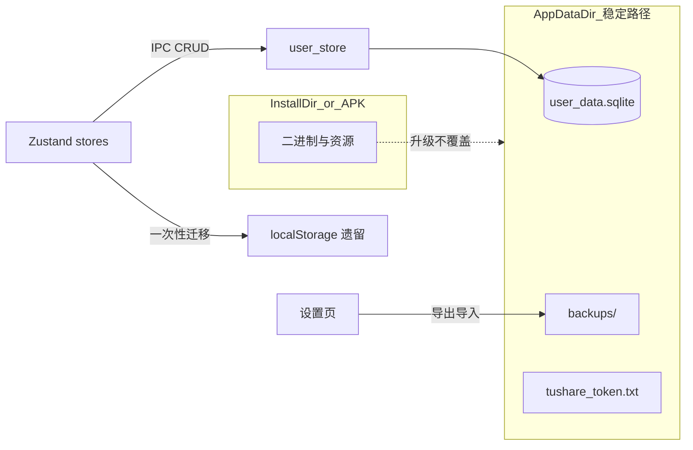
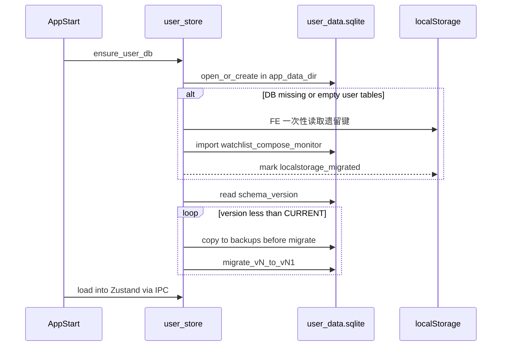

# 数据存储设计说明

| 项目 | 说明 |
|------|------|
| 范围 | 用户态持久化、路径、升级迁移、导出/导入 |
| 文档版本 | 1.0 |
| 编制日期 | 2026-07-23 |
| 关联文档 | [软件设计说明.md](./软件设计说明.md) · [盯盘助手设计说明.md](./盯盘助手设计说明.md) |
| 非目标 | 账号云同步、跨设备实时同步 |

> **免责声明**：本软件预测结果仅供研究演示，不构成任何投资建议。

---

## 一、问题与目标

旧版用户数据几乎全部在 WebView `localStorage`；Rust 仅把 Token/资金流缓存写到自定义目录，且未统一到 Tauri `app_data_dir`。

风险：清应用数据、WebView 配置目录变更、桌面 profile 重建会丢自选/策略/盯盘；无统一 `schema_version`。

**目标**：安装/升级 APK 或桌面包后，用户配置与自选等**不可丢**；清数据或换机可通过导出/导入恢复。

---

## 二、业界三类竞品对照

| 类型 | 代表形态 | 用户数据放哪 | 升级怎么保数据 | 对本产品 |
|------|----------|--------------|----------------|----------|
| **A 账号云同步型** | 同花顺 / 东财 App / 雪球 | 云端账号为主，本地 SQLite/文件作缓存 | 换机靠账号拉取；本地库带 `db_version` 迁移 | 最稳，需账号体系；**本期不做** |
| **B 本地终端隔离型** | 通达信 / 东财 PC / 多数桌面交易终端 | 安装目录外的用户目录（AppData / filesDir） | 升级只覆盖安装包，**不碰用户目录**；启动按版本迁移 | **本期主路径** |
| **C 轻量 KV + 备份型** | 独立小工具 / 部分量化助手 | SharedPreferences / localStorage / 单 JSON | 靠包名不变碰巧保留，另提供导出/导入 | **作安全网** |

**选型定稿**：**B 为主 + C 为辅**。主存为安装目录外 SQLite；设置页提供 JSON 导出/导入。

---

## 三、存储分层

| 层级 | 介质 | 内容 | 升级策略 |
|------|------|------|----------|
| **用户态（不可丢）** | `{app_data_dir}/user_data.sqlite` | 自选、策略组合、预测/选股偏好、回看、盯盘规则/开关/预警、`schema_version` | 永不随安装包删除；仅正向迁移 |
| **密钥/凭证** | `{app_data_dir}/tushare_token.txt` | Tushare Token | 与用户库同目录 |
| **可再生缓存** | `{app_data_dir}/cache/`（如 `market_fund_flow.json`） | 资金流等 | 可删可重建，不入用户库 |
| **只读资源** | 安装包 / APK `resources/` | `stocks.json`、权重 JSON | 随版本覆盖 |
| **会话态** | 内存 | 当前选中股、分析结果、选股进度 | 重启可丢 |

**路径统一**：Tauri `path().app_data_dir()`（可用环境变量 `STOCK_PREDICT_DATA` 覆盖）。**禁止**把用户库写到安装目录或 `resources/`。

- Windows 示例：`%APPDATA%\com.stockpredict.app\`（以实际 `identifier` 为准）
- Android：应用私有 files 目录
- 旧目录 `%LOCALAPPDATA%\stock-predict` / `~/.stock-predict`：首次启动若新目录缺文件则拷贝一次

包标识保持 `com.stockpredict.app`；改 identifier/包名视为迁移工程，需单独拷贝旧目录。

---

## 四、SQLite 结构（schema_version = 1）

| 表 | 说明 |
|----|------|
| `meta(key, value)` | `schema_version`、`localstorage_migrated` |
| `watchlist(...)` | 自选：`code` PK、name/market/sector、`sort_order`、`extra_json` |
| `kv_settings(key, value_json)` | lookback / predict_mode / horizon / screen_compose / monitor_enabled / UI 偏好等 |
| `strategy_compose(stock_code, compose_json)` | 按股策略组合 |
| `monitor_rules(id, rule_json)` | 盯盘规则 |
| `monitor_alerts(id, alert_json, created_at)` | 预警历史（上限 50） |

后续字段变更只加 **正向迁移** `vN → vN+1`，禁止静默清空用户表。

---

## 五、升级与不丢数据流程

**硬性规则**：

1. 安装/升级包不得删除 `app_data_dir`（包名/签名保持不变）。
2. 启动必跑：`ensure_user_db` →（必要时）备份 → 迁移 → 加载。
3. `localStorage → SQLite` 只导入一次；DB 已有用户数据则以 DB 为准；导入后主数据不再写回 localStorage。
4. 写库走事务；迁移/导入前整库拷贝到 `backups/`。
5. 迁移失败：保留备份，提示恢复/导入，**禁止**自动清空用户表。
6. 设置页导出整包用户态 JSON；导入覆盖前先自动备份。

---

## 六、代码落点

| 区域 | 职责 |
|------|------|
| `src-tauri/src/paths.rs` | `app_data_dir` / cache / 旧目录拷贝 |
| `src-tauri/src/user_store/` | 打开库、schema 迁移、CRUD、导出/导入 |
| `src-tauri/src/commands.rs` | `ensure_user_db`、`load/save_*`、`export/import_user_data`、`import_from_localstorage` |
| `src-tauri/src/capital_flow.rs` | Token 与资金流缓存路径对齐 |
| `src/services/userPersistence.ts` | 前端 IPC 封装与遗留 LS 收集 |
| `src/stores/stockStore.ts` / `monitorStore.ts` | 启动 bootstrap；读写改 IPC |
| `src/pages/SettingsPage.tsx` | 导出 / 导入入口 |

依赖：`rusqlite`（bundled）。不引入云同步 SDK。

---

## 七、验收标准

- 覆盖安装新 APK/桌面包后，自选、策略组合、盯盘规则、回看/预测偏好、Token **仍在**。
- 从仅有 localStorage 的旧版本升级，首次启动自动导入且不丢条目。
- `schema_version` 异常或迁移失败时，不出现「空库当新用户」的静默清空。
- 导出 JSON 后清应用数据再导入，用户态可恢复。
- 资金流缓存丢失不影响用户态。

---

## 八、修订记录

| 版本 | 日期 | 说明 |
|------|------|------|
| 1.0 | 2026-07-23 | 首版：B+C 选型、分层、SQLite v1、升级流程与代码落点（自软件设计说明 §3.6 抽离） |
