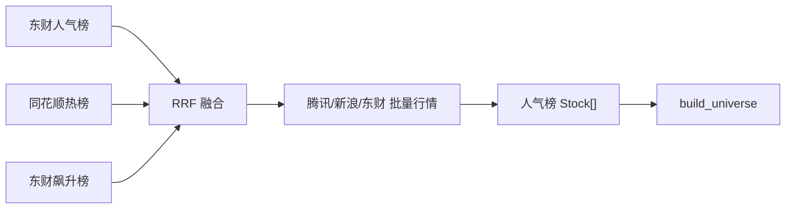
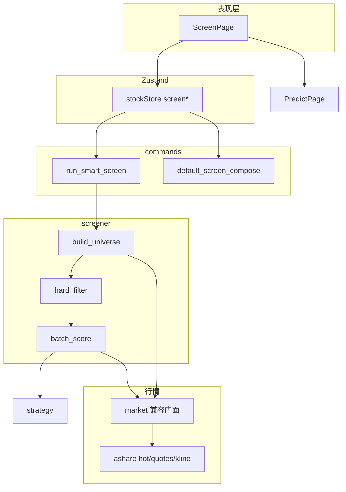

# 智能选股设计说明

| 项目 | 说明 |
|------|------|
| 产品名称 | 以太测 · 智能选股 |
| 文档版本 | 1.2 |
| 编制日期 | 2026-07-23 |
| 关联文档 | [软件设计说明.md](./软件设计说明.md) · [ashare 行情](./ashare/README.md) |

> **免责声明**：选股与预测结果仅供研究演示，不构成任何投资建议。

---

## 一、开源方案调研与选型

### 1.1 对比

| 方案 | 形态 | 优点 | 与本工程的匹配度 |
|------|------|------|------------------|
| [Sequoia-X](https://github.com/sngyai/Sequoia-X) | Python + baostock + SQLite，技术形态扫描 | 结构清晰、两阶段选股、依赖少 | 思路可借鉴；整仓嵌入会引入 Python 运行时与全市场日库，与 Tauri 单进程 Rust 路径冲突 |
| [AlphaSift](https://github.com/ZhuLinsen/alphasift) / [select-stock](https://github.com/drekiro/select-stock) | 快照过滤 → 因子打分 | 「硬过滤 + 打分排序」模式简单可靠 | 模式最优；实现需本地化，不能直接依赖 |
| [xiaopengm3/stock-picker](https://github.com/xiaopengm3-ai/stock-picker) | 41 因子七维 + AI | 量化完整 | 过重，与现有 `strategy` / `algo::factor` 重复建设 |
| [daily_stock_analysis](https://github.com/ZhuLinsen/daily_stock_analysis) | LLM 日报/推送 | 产品完整 | 定位是分析助手，非嵌入式选股引擎 |
| AKShare / Tushare / Baostock | 数据接口 | 覆盖广 | 仅作数据参考；运行时不新增 Python 依赖 |

### 1.2 选定方案

**借鉴 Sequoia-X / AlphaSift 的两阶段选股架构，在现有 Rust 领域层原生实现，不嵌入任何外部选股仓库。**

**选型理由：**

1. **简单**：阶段 1 用行情快照做截面过滤；阶段 2 复用已验证的技术信号融合，不新建 40+ 因子体系。
2. **可靠**：截面打分仅使用可回测技术源；`news` / `policy` / `us_market` 及慢速的 `message` / `capital_flow` 在批量选股中强制关闭（`compose_for_screen`）。
3. **契合工程**：保持 Tauri IPC + Rust 单进程；结果可跳转预测页走现有 `analyze_stock`。

**首期不做：** 全市场 4000+ 日线本地仓、基本面 PE/PB 深筛、LLM 研判、嵌入外部 Python 选股进程。

---

## 二、产品定义

在用户选定的 A 股股票池上，按可配置硬过滤缩小候选，再用选股策略组合计算上涨概率/置信度并排序，输出 TopN，支持加入自选或跳转预测。

| 项 | 约定 |
|----|------|
| 市场 | A 股 / A 股 ETF |
| 形态 | 条件过滤 + 策略扫描打分 |
| 默认 Universe | `mixed`：人气榜 Top50 ∪ 自选股 ∪ `stocks.json` 种子，上限 120 |
| 人气榜来源 | 多源联网采集并融合（见 §2.1），非本地静态列表 |
| 默认策略 | `factor`(40) + `momentum`(30) + `volume`(20)；见 `default_screen_compose` |
| 默认跨度 / 回看 | `horizon_days=1`，`lookback_days=50` |
| 默认 TopN / 并发 | `top_n=20`（上限 50），`concurrency=4`（上限 8） |

### 2.1 人气榜数据来源

选股 Universe 中的「人气榜 / 综合池」与首页热门共用 `ashare::hot::fetch_hot_stocks`（经 `market` 门面 re-export），**运行时联网拉取**，再批量补实时行情。

| 数据源 | 接口要点 | 权重 | 说明 |
|--------|----------|------|------|
| 东方财富 · 股吧人气榜 | `emappdata.eastmoney.com/stockrank/getAllCurrentList` | 1.0 | 浏览/讨论热度主榜 |
| 同花顺 · A 股小时热榜 | `dq.10jqka.com.cn/fuyao/hot_list_data/out/hot_list/v1/stock` | 1.0 | 搜索/关注热度 |
| 东方财富 · 股吧飙升榜 | `…/stockrank/getAllHisRcList` | 0.55 | 排名快速上升，补充「升温」标的 |

**融合方式**：三源并行请求（每源拉取 `limit×2`，夹在 20–100），对各榜名次做 Reciprocal Rank Fusion（RRF，`k=60`），多榜交叉命中优先；融合后再截断为 TopN（选股 `hot`/`mixed` 取 Top50）。任一源失败则降级使用其余源；全部失败返回 `Err`（该次人气池不可用）。

**行情补全**：融合后的代码列表走 `fetch_stock_quotes`（**腾讯 → 新浪 → 东财 push2**）；行情全失败时仍返回榜单（同花顺名称与涨跌幅兜底），告警写入控制台日志（`log_warn`），避免静默空列表。首页 `load_stocks` 另将热股相关告警写入 `StocksPayload.warning`。

**未接入（调研结论）**：腾讯无稳定公开人气接口；新浪多为涨跌幅榜而非真实人气；雪球热股接口需登录 Cookie，不适合桌面端静默拉取。官方付费 API（如同花顺 Fuyao）首期不引入。

实现位置：`src-tauri/src/ashare/hot.rs`（详见 [ashare/README.md](./ashare/README.md)）。

---

## 三、架构

| 层级 | 文件 | 职责 |
|------|------|------|
| 领域 | `src-tauri/src/screener.rs` | Universe、硬过滤、`compose_for_screen`、批量打分、K 线缓存、限流/软超时 |
| 行情 | `src-tauri/src/ashare/`（`hot` / `quotes` / `kline`） | 多源人气榜 RRF、批量行情、日 K；`market.rs` 仅 re-export |
| 算法 | `algo::factor`（经 `factor_model` 门面） | 风格化因子分与 hints；融合概率由 `strategy::evaluate_historical` |
| IPC | `commands.rs` / `lib.rs` | `run_smart_screen`、`default_screen_compose`；事件 `smart-screen-progress` |
| 模型 | `models.rs` / `types/index.ts` | `ScreenUniverse` / `ScreenFilters` / `ScreenHit` / `ScreenResult` / `ScreenProgressEvent`；请求体在 `screener::ScreenRequest` |
| 前端 | `ScreenPage.tsx`、`Layout`、`App` | 路由 `/screen`；Universe / 硬过滤 / 策略组合 / TopN / 进度 |
| 状态 | `stockStore.ts` | 条件、进度、结果；组合持久化键 `screen_compose_v1` |

---

## 四、IPC 契约

### `default_screen_compose() -> StrategyCompose`

返回选股默认组合：启用 `factor` / `momentum` / `volume`；其余源存在但默认关闭。前端 `init` /「重置为选股默认」调用。

### `run_smart_screen(request: ScreenRequest) -> ScreenResult`

**ScreenRequest**（定义于 `screener.rs`）

| 字段 | 说明 |
|------|------|
| `universe` | `hot` / `watchlist` / `seed` / `mixed`（默认 `mixed`） |
| `watchlist` | 前端传入的自选列表（mixed/watchlist 使用） |
| `filters` | `exclude_st`、`min_price`、`min_change_pct`、`max_change_pct`、`main_board_only` |
| `compose` | 可选；缺省用 `default_screen_compose`，再经 `compose_for_screen` 清洗 |
| `horizon_days` | 1–5（clamp） |
| `lookback_days` | 回看窗口；>0 时覆盖 compose 内 lookback |
| `top_n` | 默认 20，clamp 到 1–50 |
| `concurrency` | 默认 4，clamp 到 1–8 |

**compose_for_screen**：强制关闭 `news` / `policy` / `us_market` / `message` / `capital_flow`；若无任何技术源（`factor`/`momentum`/`mean_reversion`/`volume`）启用，回退到选股默认组合。

**ScreenHit**：`stock`、`up_probability`、`down_probability`、`confidence`、`direction`、`factor_score`、`hints`、可选 `error`。

**ScreenResult**：`hits`（已截断 TopN）、`universe_size`、`filtered_size`、`scored_size`、`failed_size`、`elapsed_ms`、`summary`、`timed_out`。

**进度事件** `smart-screen-progress`：`{ done, total, code }`。

批量打分：拉日 K（进程内缓存）→ `strategy::evaluate_historical`（技术源融合概率/方向）→ `factor_model::compute_styled_for_horizon`（因子分与 hints）→ 排序；**不做** walk-forward 回测。单票失败记 `error`，不中断整批；成功票按 `up_probability` ↓ → `confidence` ↓ → `factor_score` ↓ 排序后截断。整批软超时约 180s，返回已完成部分并置 `timed_out`。

---

## 五、流水线

### 阶段 0 — 构建 Universe

| `universe` | 行为 |
|------------|------|
| `hot` | `fetch_hot_stocks(50)`；失败则整次选股 `Err` |
| `watchlist` | 仅前端传入自选 |
| `seed` | `resources/stocks.json`（由 commands 读入后传入） |
| `mixed` | 人气榜 ∪ 自选 ∪ 种子，去重后上限 120；人气失败时降级为自选∪种子 |

人气榜请求与首页热门同源（首页取 Top12，选股独立再拉 Top50），不依赖前端 store 中的热股缓存。空池返回明确错误。

### 阶段 1 — 硬过滤

缺行情时按批（chunk 80）`fetch_stock_quotes` 补齐后再过滤。

- 排除名称含 `ST`（可关；大小写不敏感）
- 价格 ≥ `min_price`（默认 2）；无价格时不因价格剔除
- 涨跌幅 ∈ `[min_change_pct, max_change_pct]`（默认 -5%～+7%）；无涨跌幅时不因涨跌剔除
- 可选仅主板：排除创业板 `300`/`301`、科创板 `688`、北交所/新三板 `8*`/`4*`

### 阶段 2 — 策略打分

每票最多重试拉 K 1 次（间隔 200ms）；K 线不足 `MIN_BARS` 记失败。并发由 Semaphore 控制。

### 闭环

结果「预测」→ `applyScreenHit`（`selectStock`）+ `/predict`；「加自选」→ `toggleWatchlist`。

---

## 六、非功能

| 项 | 策略 |
|----|------|
| Universe | ≤ 120 |
| 人气榜 | 多源并行 HTTP；单源失败降级；全失败则 `Err`（mixed 可继续） |
| K 线 | 进程内缓存，key=`(code, limit)`，TTL 3600s；条目 >200 时整表清空 |
| 限流 | 并发默认 4（上限 8）；失败重试 1 次 |
| 超时 | 180s 软超时，`timed_out=true` 并返回已完成子集 |

---

## 七、实现分期

| 阶段 | 内容 | 状态 |
|------|------|------|
| **P0** | `screener` + IPC + ScreenPage 最小可用 | 已完成 |
| **P1** | 进度事件、K 线缓存、选股 StrategyComposer、结果跳转预测/自选 | 已完成 |
| **P1.1** | 人气榜多源联网（东财人气 / 同花顺热榜 / 东财飙升）+ RRF；行情下沉 `ashare` | 已完成 |
| **P2（可选）** | 更多 Universe/过滤、导出；全市场离线库另立专项 | 未做 |

---

## 八、验收（P0/P1/P1.1）

- 无 Python 依赖下可一键跑完默认池并展示排序
- 联网环境下「人气榜 / 综合池」能拉到非空热股（至少一源可用）
- 同票同 compose 与单股技术面方向大致一致（选股侧强制关 live/慢速源）
- 单票失败不导致整批崩溃；软超时仍返回部分结果
- 进度可显示；可跳转预测/加自选
- 选股组合可本地持久化（`screen_compose_v1`），并可重置为 `default_screen_compose`
