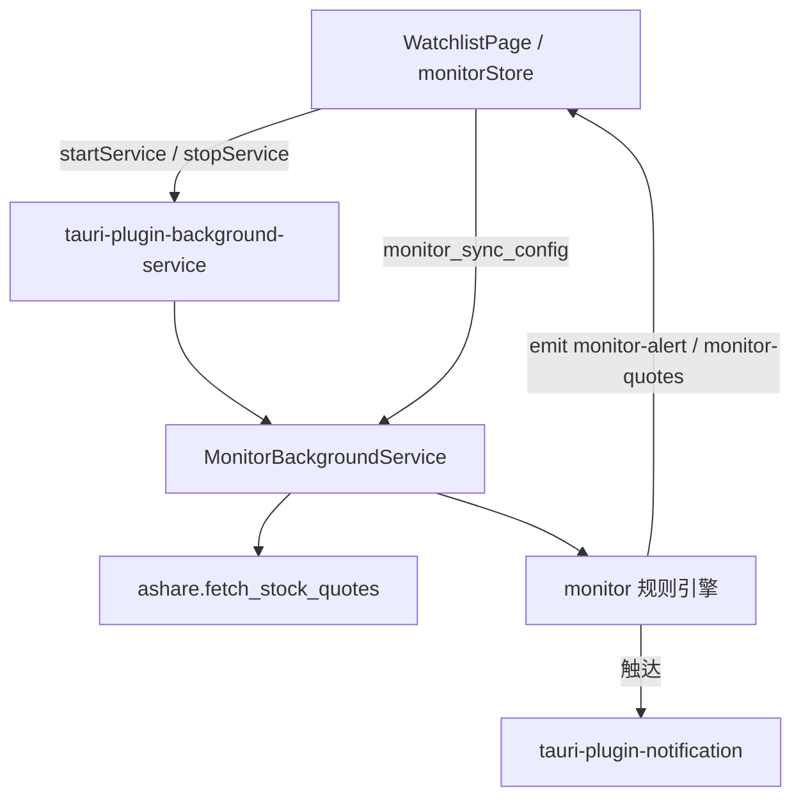

# 盯盘助手设计说明

| 项目 | 说明 |
|------|------|
| 范围 | 自选股规则预警、盘中轮询、系统通知、Android 锁屏保活 |
| 非目标 | LLM 研判、钉钉/飞书 Webhook、强制停止后偷跑、开机零点击自启 |

## 架构

## 行为摘要

- **轮询**：交易时段（工作日 09:15–11:30、13:00–15:00）默认每 15s 批量拉自选行情。
- **规则**：价格上下破、涨跌幅阈值；冷却默认 300s；日触发上限默认 5。
- **系统通知**：规则触达时由 Rust 侧 `notifier.show` 弹出（锁屏可见）。
- **锁屏保活（Android）**：前台服务类型 `dataSync`，状态栏常驻「以太测 · 盯盘中」。关闭盯盘后停止服务并去掉常驻通知。
- **Windows**：进程内 tokio 任务轮询 + 系统通知；不额外装 OS 服务。

## 持久化

盯盘规则 / 预警历史 / 启停意图写入 `{app_data_dir}/user_data.sqlite`（见 [数据存储设计说明](./数据存储设计说明.md)），经 IPC `save_monitor_*` / `save_user_settings` 落库；升级安装包不清除。

Rust 侧 `MonitorShared`（Tauri managed state）仅保存运行中的自选、规则与冷却状态；前端开启前调用 `monitor_sync_config`。

## 约束

1. 常驻通知无法去掉——Android 前台服务合规要求。
2. 用户「强制停止」或极端省电杀进程后需重新打开并开启盯盘。
3. 不承诺开机零点击自启。
4. 行情仍为 HTTP 轮询，非交易所推送；间隔过短可能触发源站限流。

## 相关代码

| 路径 | 职责 |
|------|------|
| `src-tauri/src/monitor/` | 规则、时段、引擎、BackgroundService；Android 下含 HeadlessBridge JNI 桩 |
| `scripts/patch-android-mainactivity.py` | `android init` 后设 `HeadlessBridge.nativeLibName = stock_predict_lib` |
| `src/stores/monitorStore.ts` | 规则/预警/启停 |
| `src/pages/WatchlistPage.tsx` | 开关、设预警、预警列表 |

> **Android**：后台插件默认加载 `libapp_core.so`。本应用改为 `stock_predict_lib` 并导出 JNI 桩，否则开启盯盘会报 `libapp_core.so not found`。
