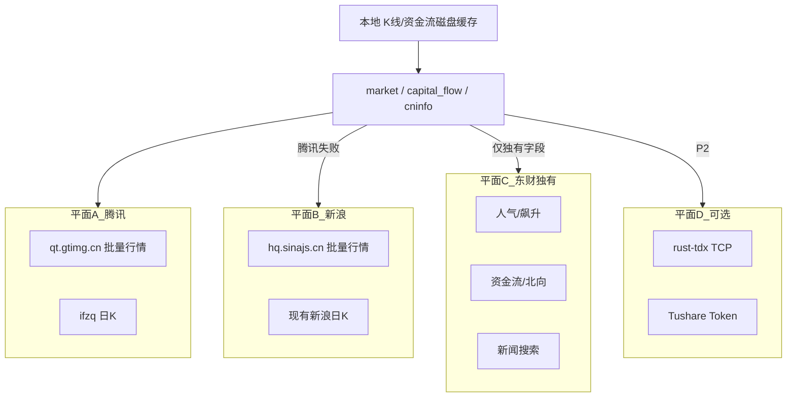

# 股市数据源调研与改造方案

| 项目 | 说明 |
|------|------|
| 产品名称 | 以太测 · 数据接入层 |
| 文档版本 | 1.0 |
| 编制日期 | 2026-07-22 |
| 关联文档 | [软件设计说明.md](./软件设计说明.md)、[智能选股设计说明.md](./智能选股设计说明.md) |

> **免责声明**：选股与预测结果仅供研究演示，不构成任何投资建议。下文所列公开接口均为非官方、可随时变更的第三方端点；接入时须控制频率、遵守对方服务条款，不得用于生产交易撮合。

---

## 一、问题与约束

### 1.1 现状痛点

运行时在 Rust（`market` / `capital_flow` / `cninfo`）中直连多家财经站点的公开 HTTP，**未引入 Python 运行时**。当前链路与痛点如下：

| 数据类型 | 当前链路 | 主要痛点 |
|----------|----------|----------|
| 批量实时行情 | 东财 `push2` / `push2delay` / 编号节点 | `push2` 在部分网络直接断连；同域名簇内加节点无法脱离东财限流平面 |
| 日 K | 腾讯 → 新浪 → 东财 | K 线相对稳；东财仅兜底 |
| 人气榜 | 东财股吧 + 同花顺热榜 + 东财飙升（RRF） | 东财人气偶发失败；已有多源降级 |
| 资金流 / 公告 / 新闻 | 东财为主，Tushare / 巨潮可选 | 东财易限流、分页慢；部分能力难完全替代 |

**根因**：实时行情过度依赖东财公开 HTTP，缺少与东财**不同限流平面**的主力源。同一 `*.eastmoney.com` 下多节点重试，对「整站不可达 / 强限流」无效。

### 1.2 工程约束

| 项 | 约定 |
|----|------|
| 市场 | A 股 / A 股 ETF（与现产品一致） |
| 运行时 | Tauri 单进程 + Rust；**零 Python** |
| 平台 | Windows 桌面、Android（TCP 源需单独验证） |
| 必需数据 | 批量报价、日 K（前复权）、人气榜、公告/新闻标题、市场级资金流（可降级） |
| 费用目标 | 优先**免费、无注册 Key**；Tushare 等积分接口仅作可选增强 |
| 非目标（首期） | 交易所官方 Level-1、付费聚合商、运行时嵌入 AKShare/BaoStock |

### 1.3 内部 DTO（改造须对齐）

[`StockQuote`](../src-tauri/src/models.rs) / [`DailyBar`](../src-tauri/src/models.rs) 字段不变，仅替换拉取与解析实现：

- `StockQuote`：`price`、`change_pct`、`change_amt`、`open`、`high`、`low`、`prev_close`、`volume`、`turnover`
- `DailyBar`：`date`、`open`、`close`、`high`、`low`、`volume`、`change_pct`

---

## 二、候选源对比

| 源 | 费用 | 协议 | 适合本工程 | 评价 |
|----|------|------|------------|------|
| **腾讯** `qt.gtimg.cn` / `sqt.gtimg.cn` / `web.ifzq.gtimg.cn` | 免费无 Key | HTTP | **主力** | 社区共识稳定性高；日 K 已接入；可补批量实时行情 |
| **新浪** `hq.sinajs.cn` + 现有日 K | 免费无 Key | HTTP | **次主力** | 与腾讯不同域名平面；适合 failover |
| **东财** push2 / datacenter / 人气 / 搜索 | 免费无 Key | HTTP | **独有能力** | 人气、资金流、新闻仍依赖；须节流，**不作实时主力** |
| **同花顺** 热榜等 | 免费无 Key | HTTP | 人气补充 | 已接入；保留 |
| **通达信 TCP**（`rust-tdx` / mootdx） | 免费节点基础数据 | TCP:7709 | P2 增强 | 几乎不封 IP；需服务器池；移动端/防火墙需实测 |
| **BaoStock** | 免费无注册 | Python API | **仅离线脚本** | 自有服务器、日 K 较准；与运行时零 Python 冲突 |
| **Tushare Pro** | 积分 / 付费 | HTTP + Token | 可选增强 | 工程内已有 token 路径；资金流可用；非「纯免费」 |
| **交易所官方 Level-1** | 机构年费 | 专线 / 授权 | 否 | 个人桌面产品不可用 |
| **AllTick 等聚合商** | 试用后付费 | REST / WS | 否（首期） | 稳定性好但偏离免费目标 |
| **AKShare** | 免费 | Python 封装 | 否（运行时） | 多为东财等二次封装，故障点更多；仅离线可参考 |

### 2.1 为何不以「再加几个东财节点」了事

东财公开接口在量化社区被广泛复用，易触发 **IP 限流 / 连接重置**。同一限流平面内扩节点只能缓解偶发断连，无法覆盖：

- DNS / 防火墙阻断 `*.eastmoney.com`
- 全站 WAF 或地区性不可达
- 批量选股并发打满后的封禁

正确方向是引入 **腾讯 / 新浪（及可选通达信 TCP）** 等独立平面，东财收缩到「独有字段」。

### 2.2 明确排除项

| 方案 | 排除理由 |
|------|----------|
| 运行时 Python（BaoStock / AKShare / mootdx） | 与 Tauri 单进程、Android 打包、零 Python 运行时冲突 |
| 上交所 / 深交所官方行情 | 面向会员机构，年费与资质不适合本产品 |
| AllTick / 同类商用 API（首期） | 需 Token 与配额，偏离「免费稳定」主目标；后续若商业化可单独立项 |
| 雪球人气等需登录 Cookie 的接口 | 桌面端无法静默持有会话 |

---

## 三、推荐架构

### 3.1 多限流平面故障切换



**核心策略**：按限流平面切换，而不是在同一东财域名簇内加节点。

| 数据类型 | 推荐优先级 |
|----------|------------|
| 实时行情 | 腾讯批量 → 新浪 →（可选）通达信 TCP → 东财 delay（最后兜底） |
| 日 K | 腾讯 → 新浪 → 东财；叠加按 code 的**磁盘日 K 缓存**（交易日增量） |
| 人气榜 | 维持现有 RRF；榜单成功后用腾讯/新浪补行情，东财行情失败不拖垮列表 |
| 资金流 | Tushare（有 token）→ 东财（节流）→ 腾讯成交额代理（已有） |
| 公告 / 新闻 | 东财 → 巨潮（已有）；东财请求统一串行节流 |

**不引入**：运行时 Python、付费交易所直连、首期 AllTick。

### 3.2 关键接口要点（实现参考）

#### 腾讯批量实时行情（P0 主力）

```
GET https://qt.gtimg.cn/q=sh600519,sz000001
# 或 https://sqt.gtimg.cn/q=sh600519,sz000001
```

- 编码多为 **GBK**，Rust 侧需按 GBK 解码后再按 `~` 切分字段。
- 建议 `Referer: https://finance.qq.com/`（或 `stockapp.finance.qq.com`），批量查询、间隔 ≥100ms 量级。
- 与现有 `to_tencent_symbol`（`sh`/`sz` + 代码）一致。
- 字段映射示意（下标因接口版本可能微调，实现时以实测为准）：

| StockQuote 字段 | 腾讯 `~` 分段（常见） |
|-----------------|----------------------|
| name / code | 1 / 2 |
| price | 3 |
| prev_close | 4 |
| open | 5 |
| volume | 6（手，需换算） |
| change_amt / change_pct | 31 / 32 |
| high / low | 33 / 34 |
| turnover | 37（万元量级，需换算） |

#### 新浪批量实时行情（P0 次主力）

```
GET https://hq.sinajs.cn/list=sh600519,sz000001
```

- 返回 JS 赋值字符串；`Referer` 建议新浪财经域名。
- 与现有 `to_sina_symbol` 一致；解析后映射到同一 `StockQuote`。

#### 日 K（已有，保持顺序）

| 优先级 | URL |
|--------|-----|
| 1 | `https://web.ifzq.gtimg.cn/appstock/app/fqkline/get`（前复权 day） |
| 2 | `https://money.finance.sina.com.cn/quotes_service/api/json_v2.php/CN_MarketData.getKLineData` |
| 3 | `https://push2his.eastmoney.com/api/qt/stock/kline/get` |

#### 东财（降级为独有能力 + 最后行情兜底）

| 用途 | 端点族 |
|------|--------|
| 行情兜底 | `push2delay` / `push2` / `82.push2`（现有 `QUOTE_URLS`） |
| 人气 / 飙升 | `emappdata.eastmoney.com/stockrank/...` |
| 资金流 / 北向 | `push2delay` fflow、`datacenter-web.eastmoney.com` |
| 新闻 / 公告 | `search-api-web`、`np-anotice-stock` 等 |

所有东财请求建议统一走 **串行节流**（间隔 ≥1s + 抖动、会话复用），避免批量选股打爆。

#### 通达信 TCP（P2）

- 协议：公网行情服务器 `*:7709` 二进制协议。
- Rust 可选 crate：`rust-tdx`（对标 mootdx / pytdx），支持连接池与故障转移。
- 免费节点通常覆盖：股票列表、日 K、基础报价；部分 Level-1 深度需付费节点。
- **桌面先行**；Android 需验证运营商对 7709 出站与后台保活。

#### 离线专用（不进运行时）

| 工具 | 用途 |
|------|------|
| BaoStock | `scripts/` 预热日 K / 训练样本 |
| Tushare | 已有：资金流种子、`TUSHARE_TOKEN` / 设置页 |
| AKShare | 仅作离线脚本兜底参考（如 `fetch_market_fund_flow.py`） |

---

## 四、对本工程的改造分期

| 阶段 | 内容 | 触及文件 |
|------|------|----------|
| **P0** | 腾讯 `qt.gtimg.cn` / `sqt.gtimg.cn` 批量行情解析；`fetch_stock_quotes` 主路径改腾讯优先 | [`src-tauri/src/market.rs`](../src-tauri/src/market.rs) |
| **P0** | 新浪 `hq.sinajs.cn` 作为第二行情源；统一映射到 `StockQuote`；东财节点退为最后兜底 | 同上 |
| **P0** | 人气榜 `fetch_hot_stocks` 补行情走新的多平面 `fetch_stock_quotes`（不再绑死东财） | `market.rs`、调用方不变 |
| **P1** | 日 K / 资金流磁盘缓存与 freshness；按 code+交易日增量；弱网可读缓存 | `market.rs`、`capital_flow.rs`、`%LOCALAPPDATA%/stock-predict/` |
| **P1** | 源级健康探测与成功率日志（控制台 / `warning` 字段） | `market.rs`、`commands.rs` 告警透出 |
| **P1** | 东财请求统一串行节流（间隔 + 抖动），专用于人气 / 资金 / 新闻 | `market.rs`、`capital_flow.rs`、`strategy.rs`、`cninfo.rs` |
| **P2** | 评估接入 `rust-tdx` 作第三行情 / K 线平面（桌面优先；Android 实测后再开） | 新模块或 `market.rs` 适配层 |
| **离线** | BaoStock / Tushare 仅用于 `scripts/` 预热缓存与训练 | [`scripts/`](../scripts/) |

### 4.1 P0 伪代码（行情）

```text
fetch_stock_quotes(stocks):
  try return parse_tencent(qt.gtimg.cn, symbols)
  catch: log planeA
  try return parse_sina(hq.sinajs.cn, symbols)
  catch: log planeB
  try return parse_eastmoney(QUOTE_URLS, secids)   # 现有逻辑
  catch: return Err + warning
```

日 K 保持现有 `fetch_daily_klines` 顺序，无需为 P0 改协议，仅在 P1 叠加磁盘缓存。

### 4.2 与现有模块边界

| 模块 | 改造后职责变化 |
|------|----------------|
| `market` | 行情主源换腾讯/新浪；东财行情降级；人气/搜索仍可调东财 |
| `capital_flow` | 逻辑优先级不变；东财路径加节流；磁盘缓存加强 freshness |
| `cninfo` / `strategy` | 公告/新闻仍东财+巨潮；东财侧节流 |
| `screener` / `commands` | IPC 契约不变；受益于更稳的 `fetch_stock_quotes` |
| 前端 | 无强制改动；可展示更明确的 `warning` |

---

## 五、验收标准

1. **断东财**：屏蔽或不可达 `*.eastmoney.com` 时，首页热门补行情、单股预测日 K、选股硬过滤报价仍可用（腾讯 / 新浪 / 本地缓存至少一路成功）。
2. **人气降级**：东财人气失败、同花顺仍可用时，综合池非空；行情用腾讯补全。
3. **全源失败**：写入明确 `warning` / 控制台日志，**不静默空列表**。
4. **运行时约束**：不新增 Python 运行时依赖；可选 Tushare 保持「无 token 可降级」。
5. **限流**：东财独有路径在批量场景下不因并发打爆（P1 节流后可测：连续 50 次人气/资金请求无大面积 403/空包）。

---

## 六、风险与合规

| 风险 | 缓解 |
|------|------|
| 公开接口无 SLA，字段/URL 随时变更 | 多平面 + 解析单测 + 源级成功率监控 |
| 高频封 IP | 批量合并请求、缓存、东财串行节流、并发上限（选股已有 semaphore） |
| GBK / 编码差异 | 腾讯/新浪解析集中封装，单元测试固定样例串 |
| Android 出站限制 | P0 仅用 HTTPS；P2 TCP 单独 feature flag |
| 数据用途合规 | 产品内已有免责声明；仅研究演示，不做交易通道 |

---

## 七、结论与下一步

| 结论 | 说明 |
|------|------|
| 主力实时源 | **腾讯 HTTP 批量行情**（免费、无 Key、平面独立） |
| 次主力 | **新浪 HTTP** |
| 东财定位 | 人气 / 资金 / 新闻等独有能力 + 行情最后兜底，并节流 |
| 长期增强 | 磁盘缓存（P1）→ 通达信 TCP（P2） |
| 离线 | BaoStock / Tushare / AKShare 仅脚本层 |

**建议实施顺序**：先落地 **P0（腾讯 + 新浪行情）**，即可显著缓解「东财经常访问不了」导致的首页/选股空白；再做 P1 缓存与节流，最后按需评估 rust-tdx。

本文档确认后，另开实现任务修改 `market.rs` 等代码；**本稿不包含代码改动**。

> **实施备注（2026-07-23）**：P0 已落地——`ashare::quotes::fetch_stock_quotes` 为腾讯 → 新浪 → 东财；人气榜补行情走同一路径。
