# 以太测（StockPredict）软件设计说明

| 项目 | 说明 |
|------|------|
| 产品名称 | 以太测 |
| 包标识 | `com.stockpredict.app` |
| 技术栈 | Tauri 2 · React 19 · Vite 6 · TypeScript · Tailwind CSS 4 · Rust · Python（离线） |
| 运行平台 | Windows 桌面、Android |
| 文档版本 | 1.0 |
| 编制日期 | 2026-07-20 |

> **免责声明**：本软件预测结果仅供研究演示，不构成任何投资建议。

---

## 一、软件架构设计说明

### 1. 软件架构分层图及说明

#### 1.1 逻辑分层总览

系统采用 **前后端同进程、IPC 边界清晰** 的 Tauri 跨端架构：WebView 承载 UI，Rust 承载行情接入、策略融合、预测与回测；Python 仅用于离线训练与调参，不参与运行时推理。

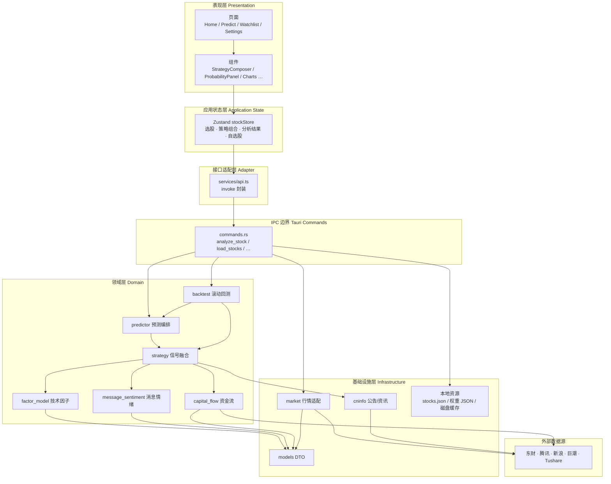

#### 1.2 各层职责

| 层级 | 代码位置 | 职责 |
|------|----------|------|
| 表现层 | `src/pages/`、`src/components/` | 选股、策略配置、概率/信号明细、K 线、场景路径、回测结果展示；桌面侧栏 / 手机底栏导航 |
| 应用状态层 | `src/stores/stockStore.ts` | 全局选股与分析状态；策略组合按股票持久化；触发 `runPrediction` |
| 接口适配层 | `src/services/api.ts` | 将前端类型映射为 Tauri `invoke`；统一错误与参数命名（camelCase） |
| IPC 边界 | `src-tauri/src/commands.rs` | 唯一对外命令面；组装「行情 + 预测 + 回测」一体化结果 |
| 领域层 | `predictor` / `strategy` / `backtest` / `factor_model` / `message_sentiment` / `capital_flow` | 信号评估、加权融合、方向判定、walk-forward 回测 |
| 基础设施层 | `market` / `cninfo` / `models` / `resources/` | HTTP 拉取、代码映射、DTO、资源与本地缓存 |
| 离线工具层 | `scripts/*.py` | LightGBM 训练、宽基关键词/因子调优、资金流探针；产出 JSON 资源供运行时读取 |

#### 1.3 进程与部署视图

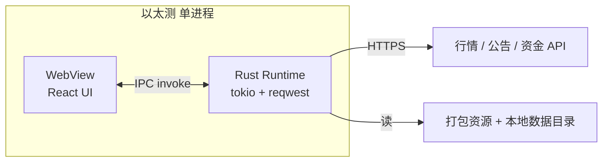

- **桌面**：`npm run tauri:dev` / `tauri:build`，窗口产品名「以太测」。
- **Android**：同一套 React + Rust；`lib.rs` 使用 `#[cfg_attr(mobile, tauri::mobile_entry_point)]`；资源优先读 APK assets，失败则 `include_str!` 内嵌兜底。
- **纯前端预览**（`npm run dev`）无 Rust 后端，API 调用会失败，仅用于 UI 调试。

---

### 2. 核心模块及关系说明

#### 2.1 模块关系图

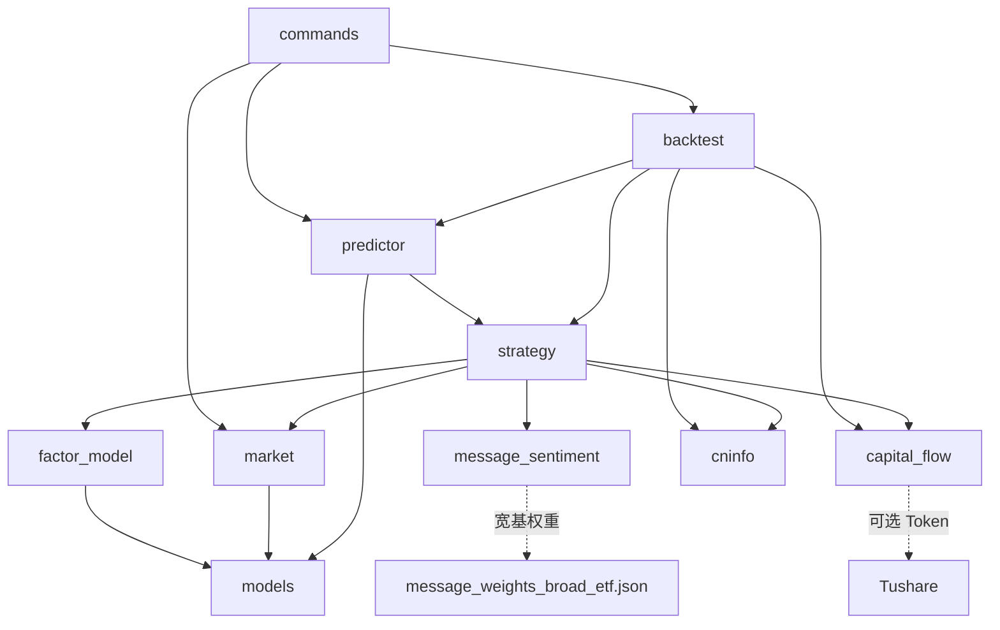

#### 2.2 模块一览

| 模块 | 路径 | 核心职责 | 主要依赖 |
|------|------|----------|----------|
| **commands** | `src-tauri/src/commands.rs` | Tauri 命令入口；选股加载、一体化分析、回测、策略目录、Token 配置 | market, predictor, backtest, strategy |
| **models** | `src-tauri/src/models.rs` | 前后端共享 DTO：`Stock`、`DailyBar`、`PredictionResult`、`AnalysisResult` 等 | serde |
| **market** | `src-tauri/src/market.rs` | 代码映射、批量行情、日 K（腾讯→新浪→东财兜底）、热股、搜索 | 外部行情 API |
| **strategy** | `src-tauri/src/strategy.rs` | 信号源目录、默认/按股推荐组合、live/historical 评估、宽基门控、加权 `fuse` | factor_model, message_sentiment, capital_flow, cninfo |
| **factor_model** | `src-tauri/src/factor_model.rs` | 个股 / 宽基 ETF 两套技术因子打分；多日 horizon 特化 | models |
| **predictor** | `src-tauri/src/predictor.rs` | 组合预测编排、交易日推算、高置信判定、场景路径生成 | strategy |
| **backtest** | `src-tauri/src/backtest.rs` | walk-forward 滚动回测；有效信号 / 高置信口径统计 | predictor, strategy, cninfo, capital_flow |
| **message_sentiment** | `src-tauri/src/message_sentiment.rs` | 按标的分型词表；标题情绪打分；宽基加权关键词 + 时间衰减 | 资源 JSON |
| **cninfo** | `src-tauri/src/cninfo.rs` | 公告/资讯归档；按日 `as_of` 切片防未来泄漏 | 东财 / 巨潮等 |
| **capital_flow** | `src-tauri/src/capital_flow.rs` | 主力净流入 / 成交额代理 / 北向；内存+磁盘缓存；按日评估 | Tushare / 东财 / 腾讯 |
| **前端 Store** | `src/stores/stockStore.ts` | UI 状态与分析触发 | api.ts |
| **前端 API** | `src/services/api.ts` | invoke 一一封装 | @tauri-apps/api |
| **离线脚本** | `scripts/` | 训练 LGBM、调优宽基因子/消息权重、探针资金流 | Python |

#### 2.3 信号源目录（strategy catalog）

| ID | 名称 | 类别 | 可回测 | 说明 |
|----|------|------|--------|------|
| `factor` | 技术多因子 | 技术面 | 是 | MA/RSI/动量/量能；宽基切 MA20+隔日反向 |
| `momentum` | 趋势动量 | 技术面 | 是 | 短中期动量；宽基用 3 日动量互补 |
| `mean_reversion` | 均值回归 | 技术面 | 是 | 偏离 MA20 / RSI 极端反转 |
| `volume` | 量价确认 | 技术面 | 是 | 放量涨跌 / 缩量整理 |
| `message` | 消息面 | 舆情 | 是 | 行业/主题关键词情绪（可回测） |
| `news` | 资讯新闻 | 舆情 | 否 | 财经资讯标题（仅 live） |
| `policy` | 政策面 | 宏观 | 否 | 政策监管关键词（仅 live） |
| `us_market` | 美股联动 | 宏观 | 否 | 纳指/标普隔夜（仅 live） |
| `capital_flow` | 资金流(主力) | 资金面 | 是 | 主力 > 成交代理 > 北向 |

#### 2.4 Tauri 命令面

| 命令 | 作用 |
|------|------|
| `load_stocks` | 读 `stocks.json` + 热股 + 批量行情 |
| `search_stocks` | 东财搜索并补行情 |
| `analyze_stock` | 行情 + K 线 + 组合预测 + 回测（主入口） |
| `predict_stock` | 复用分析，仅返回 `prediction` |
| `get_stock_klines` | 日线 K |
| `backtest_stock` | 单独回测 |
| `list_algorithms` | 算法列表（`compose` / `placeholder_v1`） |
| `list_strategy_sources` | 信号源目录 |
| `default_strategy_compose` | 默认组合 |
| `default_strategy_compose_for_stock` | 按标的推荐（宽基：因子 70% + 消息 30%） |
| `get_tushare_token_status` / `set_tushare_token` | Tushare Token |

---

### 3. 核心数据流程图及说明

#### 3.1 启动与选股

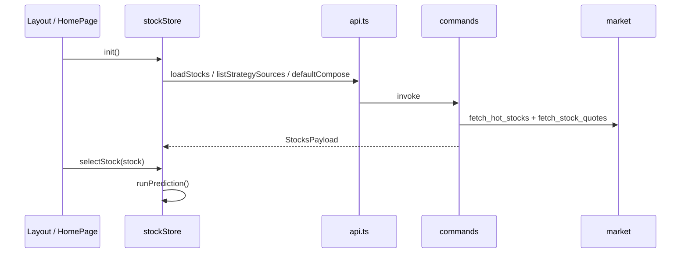

#### 3.2 一体化分析主路径（预测 + 回测）

用户在预测页点击分析，或切换策略/跨度后自动触发：

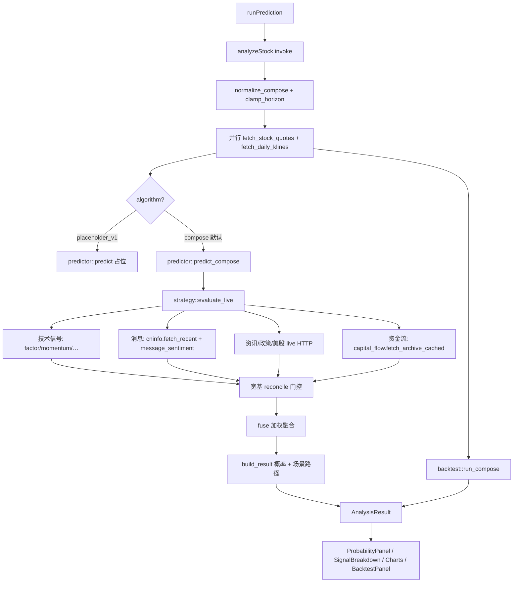

**关键参数约定**（`analyze_stock`）：

- `lookback_days`：特征回看窗口（写入 compose）。
- `horizon_days`：预测跨度 1–5 个交易日。
- K 线拉取量：`lookback + 120 + horizon`，保证 walk-forward 有足够样本。

#### 3.3 Walk-forward 回测数据流

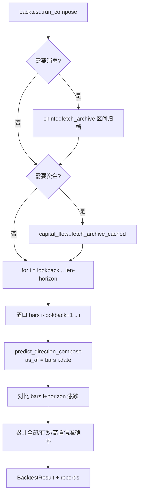

**防未来泄漏**：

- 消息、资金均按 `as_of` 日期切片，只用当日及以前信息。
- `news` / `policy` / `us_market` 标记 `backtestable=false`，回测中跳过（与 live 不完全同构）。

#### 3.4 消息面与资金流子流

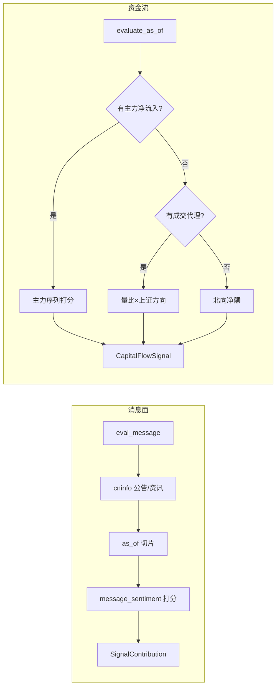

#### 3.5 核心数据结构流转

| 阶段 | 主要类型 |
|------|----------|
| 选股 | `Stock` → `StocksPayload` |
| 行情 | `StockQuote`、`DailyBar[]` |
| 策略配置 | `StrategyCompose`（sources + lookback_days） |
| 单源输出 | `SignalContribution`（up/down/confidence/weight/status/note） |
| 融合结果 | `EnsembleSignal` → `PredictionResult`（含 scenarios） |
| 回测 | `BacktestRecord[]` → `BacktestResult` |
| 一体化 | `AnalysisResult { prediction, klines, backtest }` |

前端 `src/types/index.ts` 与 Rust `models.rs` 字段对齐，经 serde JSON 跨 IPC。

#### 3.6 本地持久化

| 存储 | 键 / 路径 | 内容 |
|------|-----------|------|
| localStorage | `strategy_compose_by_stock_v1` | 按股票策略组合 |
| localStorage | `predict_mode_v1` / `predict_horizon_days_v1` | 预测模式与跨度 |
| localStorage | `watchlist_v2` / `lookbackDays` | 自选股、回看天数 |
| 磁盘 | `%LOCALAPPDATA%/stock-predict/` 或 `STOCK_PREDICT_DATA` | `tushare_token.txt`、资金流缓存 |

---

## 二、模块设计说明

### 1. 各个模块内部设计图及说明

#### 1.1 前端模块（表现层 + 状态层）

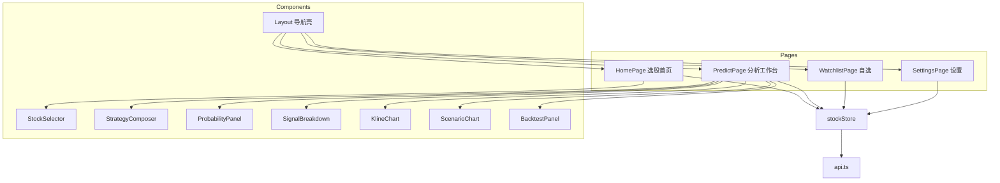

| 子模块 | 说明 |
|--------|------|
| **Layout** | 桌面侧栏 / 移动底栏；挂载路由与全局初始化 |
| **HomePage + StockSelector** | 热股、搜索、列表选股 |
| **PredictPage** | 策略组合、预测跨度、触发分析、结果区编排 |
| **StrategyComposer** | 开关信号源、调权重、一键应用「按股推荐」 |
| **ProbabilityPanel** | 涨跌概率、高置信标识、摘要 |
| **SignalBreakdown** | 各源贡献明细（含 skip/degraded） |
| **KlineChart / ScenarioChart** | 历史 K 线；高开/低开演示路径 |
| **BacktestPanel** | 准确率、有效信号、逐日记录 |
| **SettingsPage** | 算法、回看、Tushare Token |
| **stockStore** | `init` / `selectStock` / `runPrediction` / `updateCompose` / 自选股 CRUD |

#### 1.2 commands（IPC 边界）

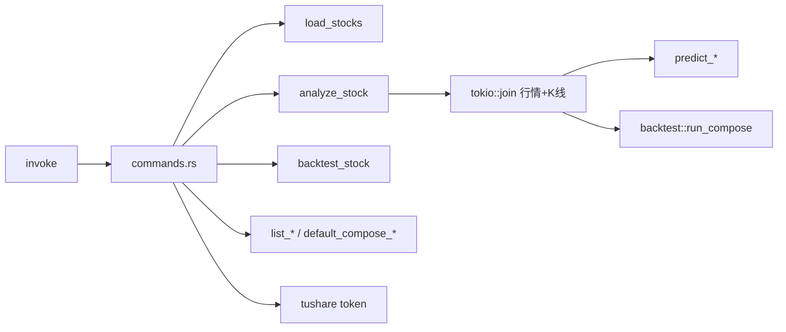

`analyze_stock` 是系统主用例：一次请求完成报价刷新、足够长度的日 K、组合预测与滚动回测，返回 `AnalysisResult`。

#### 1.3 market（行情适配）

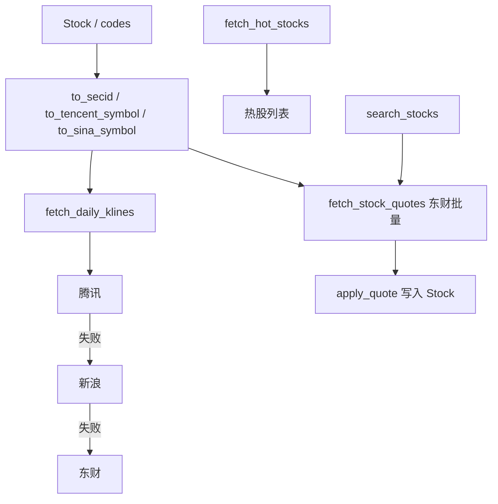

#### 1.4 strategy（策略引擎）— 系统核心

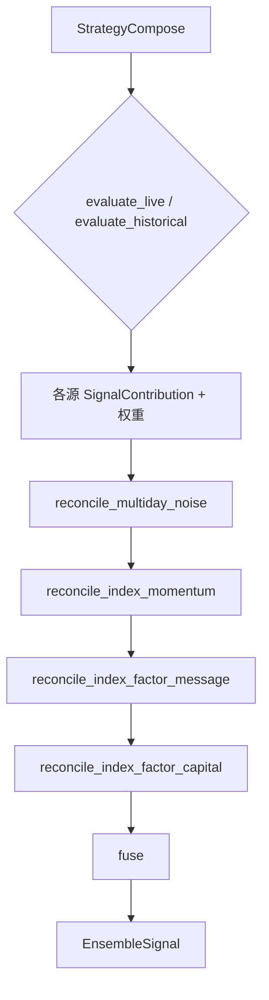

内部评估函数：`eval_factor`、`eval_momentum`、`eval_mean_reversion`、`eval_volume`、`eval_message*`、`eval_capital_flow`，以及 live 专用的资讯/政策/美股评估。

#### 1.5 factor_model（技术因子）

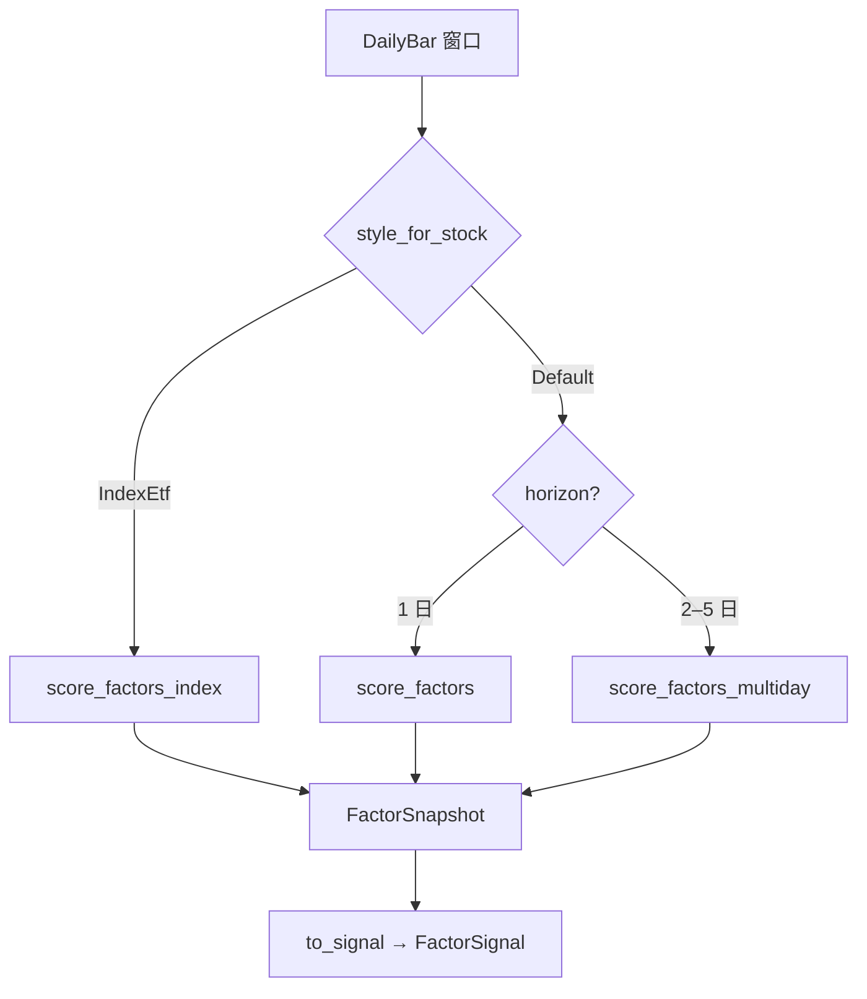

#### 1.6 predictor（预测编排）

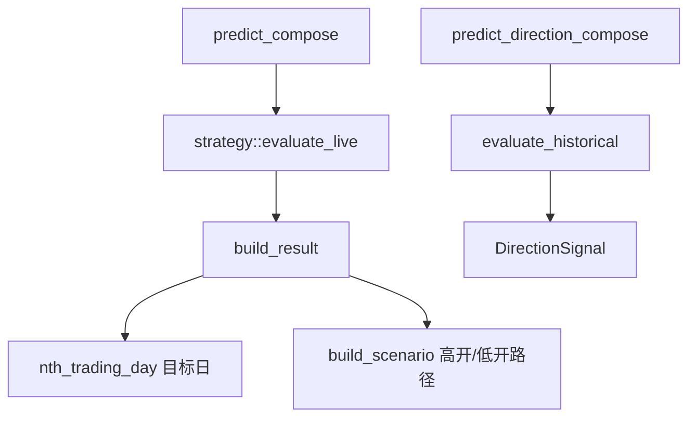

场景路径使用波动率 + 趋势偏置 + 确定性 `SeededRng`，用于 UI 演示，**非严格定价模型**。

#### 1.7 backtest（回测）

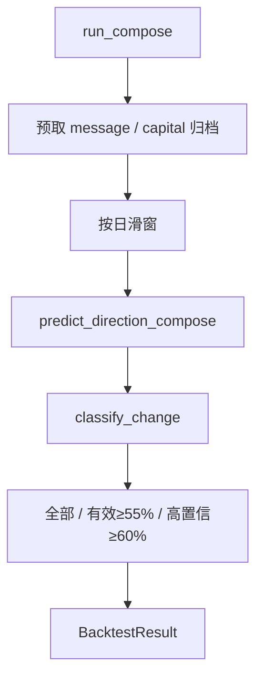

#### 1.8 message_sentiment + cninfo

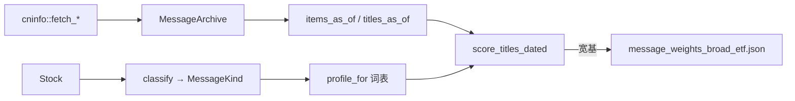

#### 1.9 capital_flow（资金流）

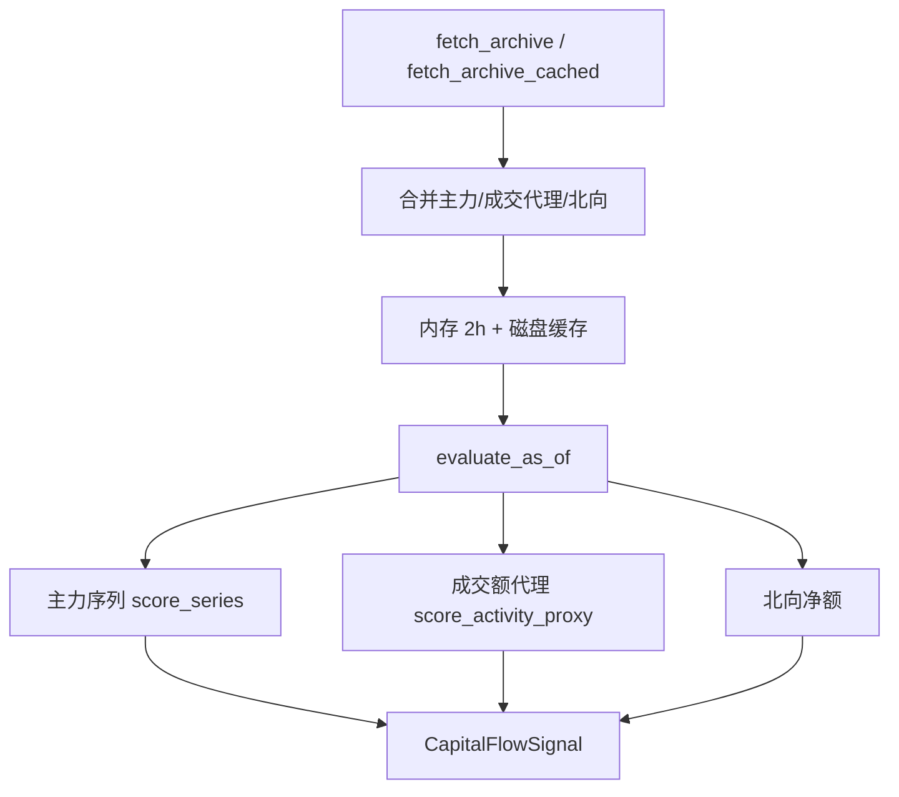

#### 1.10 离线脚本与运行时边界

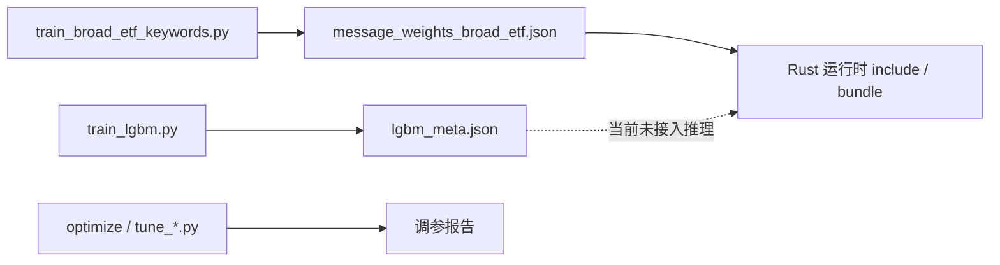

说明：仓库内存在 `models/lgbm_meta.json`，但 **Rust 运行时未加载 LightGBM/ONNX**；在线预测路径为规则因子 + 策略融合。

---

### 2. 各个模块的核心逻辑及算法说明

#### 2.1 组合融合算法（strategy::fuse）

1. 各启用信号源输出 `(up, down, confidence)` 与权重 `w`。
2. 宽基门控可能将冲突/弱信号权重置 0（仍展示明细，`status=skip`）。
3. 对 `w > 0` 的源做权重归一化，加权累加 up / down / confidence。
4. 将 up+down 再归一到百分比，并 **clamp 到 [8%, 92%]**。
5. `predicted = up >= down ? "up" : "down"`。
6. `high_confidence`：领先一侧概率 ≥ **60%**（`HIGH_CONF_THRESHOLD`）。

**score → 概率**（`probs_from_score`）：

\[
\begin{aligned}
\text{strength} &= \min(|score|, 2.5) / 2.5 \\
\text{confidence} &= \mathrm{clamp}(45 + 40\cdot\text{strength},\; 40,\; 92) \\
\text{up\_share} &= \mathrm{clamp}\bigl(0.5 + \mathrm{clamp}(score/2.5, -0.45, 0.45),\; 0.08,\; 0.92\bigr)
\end{aligned}
\]

宽基消息使用 `probs_from_score_soft`：弱分（|score|<0.15）直接中性；中等强度映射到约 55%–66% 领先概率，避免虚假高置信。

#### 2.2 宽基调和门控

| 函数 | 规则 |
|------|------|
| `reconcile_index_momentum` | 多因子与动量方向冲突 → 动量中性且权重清零 |
| `reconcile_index_factor_message` | 消息领先 <55% 或与多因子冲突 → 不计入融合 |
| `reconcile_index_factor_capital` | 资金流弱信号/冲突 → 不计入融合 |
| `reconcile_multiday_noise` | horizon>1 时对消息/资金/均值回归等降权（×0.2–0.35） |

目的：宽基以「隔日反向多因子」为主干，辅源仅在同向且足够强时增强，避免把概率拉向 50%。

#### 2.3 技术多因子（factor_model）

**风格选择** `style_for_stock`：名称/代码识别宽基指数 ETF → `IndexEtf`，否则 `Default`。

**个股次日** `score_factors`（score ∈ [-2.5, 2.5]）：

| 因子 | 逻辑要点 |
|------|----------|
| 均线排列 | 多头 +1.0 / 空头 -1.0 / 交织时看相对 MA20 ±0.25 |
| MA20 偏离 | 过远（>|6%|）偏回归；温和偏离顺势 |
| RSI(14) | <32 超卖加分；>68 超买减分；中间弱趋势 |
| 动量 | 5 日、10 日动量线性贡献 |
| 量比 | >1.4 确认方向；<0.7 缩量衰减 |

**宽基次日** `score_factors_index`：

| 因子 | 权重/行为 |
|------|-----------|
| 站上/跌破 MA20 | ±0.5 |
| **隔日反向**（昨涨→看跌，昨跌→看涨） | ±1.0（主贡献） |
| 均线多空排列 | ±0.6 |
| 相对 MA20 偏离回归 | `-dev × 3` |
| 高波动（ATR% > 1.5%） | 反向再加 0.5×fade |
| 放量（量比 > 1.5） | 昨涨时略减分（减弱追价） |

**个股多日** `score_factors_multiday`：抬高与 horizon 对齐的动量，弱化 RSI，偏趋势跟踪。

辅助指标：`sma`、`momentum`、`volume_ratio`、`rsi`、`atr_pct`；最少 K 线 `MIN_BARS = 25`。

#### 2.4 趋势动量 / 均值回归 / 量价（strategy 内）

- **momentum**：个股用短中期收益；宽基改为约 3 日动量，避免与隔日反向重复。
- **mean_reversion**：价格相对 MA20、RSI 极端时反向计分。
- **volume**：放量上涨看多、放量下跌看空、缩量整理偏中性。

均通过 `contrib` / `probs_from_score` 转为统一的 `SignalContribution`。

#### 2.5 消息情绪（message_sentiment）

1. `classify(stock)` → `MessageKind`（黄金、金融、科技、宽基等）。
2. `profile_for` 取看多/看空关键词表；宽基叠加 `message_weights_broad_etf.json` 加权词。
3. `score_titles_dated`：长词优先匹配防重复计分；`recency_weight` 近日报权。
4. 回测与 live 共用打分函数，差异仅在标题集合是否经 `as_of` 切片。

公告拉取优先级（cninfo）：东财公告 → 资讯搜索 → 巨潮；默认消息回看约 7 日（宽基可更长）。

#### 2.6 资金流（capital_flow）

**按日评估优先级**：

1. **大盘主力净流入**（Tushare / 东财）：近约 40 日相对近 20 日中位强度，1 日与 5 日累计混合打分。
2. **两市成交额代理**（腾讯上证+深成指，免费）：量比 × 上证涨跌方向规则；无 Token 时可回测。
3. **北向净买入**（历史段可用）。

缺数据日返回 `status=skip`，融合权重清零。`fetch_archive_cached` 使用约 2 小时内存缓存 + 磁盘缓存加速。

#### 2.7 预测编排（predictor）

| API | 用途 |
|-----|------|
| `predict_compose` | live：拉外部数据 + 融合 + 场景图 |
| `predict_compose_historical` / `predict_direction_compose` | 回测：只用归档 as_of |
| `clamp_horizon` | 限制 1–5 |
| `next_trading_day` / `nth_trading_day` | A 股周末与节假日跳过（内置假期表） |
| `placeholder_v1` | 基于 code+算法+日期哈希的伪随机，仅对比演示 |

#### 2.8 回测口径（backtest）

| 指标 | 定义 |
|------|------|
| 全部准确率 | 每个可预测日均计入 |
| 有效信号准确率 | 领先概率 ≥ **55%**（`ACTIONABLE_LEAD`）才计入 |
| 高置信准确率 | 领先概率 ≥ **60%** |
| 涨/跌命中率 | 按预测方向分组统计；有效口径另列 |
| 实际涨跌分类 | 按 `change_pct` 相对阈值阈值阈值（平盘阈值见结果字段） |

消息主策略时摘要强调「有效信号」口径，因弱消息日大量中性。

#### 2.9 默认策略权重

**通用默认**（`default_compose`）：lookback=50；factor 35 / momentum 20 / volume 15（其余默认关闭）。

**宽基推荐**（`default_compose_for_stock`）：lookback=120；**factor 70% + message 30%**（离线 OOS 调优参考值，见代码注释）。

`normalize_compose`：补全新源、裁剪未知源、规范化权重与回看天数。

#### 2.10 LightGBM（离线，非运行时）

- 脚本：`scripts/train_lgbm.py` 等，产出元数据/权重/报告。
- 当前产品路径 **不加载** ONNX/LGBM 推理；在线算法为规则因子 + 多信号融合。
- 设计预留：未来可将 LGBM 作为独立 `strategy` 源接入 catalog。

---

## 附录

### A. 工程目录速查

```
stock-predict/
├── src/                          # React 前端
│   ├── pages/
│   ├── components/
│   ├── stores/stockStore.ts
│   ├── services/api.ts
│   └── types/index.ts
├── src-tauri/
│   ├── src/                      # Rust 领域与基础设施
│   ├── resources/
│   │   ├── stocks.json
│   │   ├── message_weights_broad_etf.json
│   │   └── models/lgbm_meta.json
│   ├── capabilities/
│   ├── tauri.conf.json
│   └── tauri.android.conf.json
├── scripts/                      # 离线训练 / Android 脚本
└── docs/                         # 本文档
```

### B. 关键阈值常量

| 常量 | 值 | 含义 |
|------|-----|------|
| `HIGH_CONF_THRESHOLD` | 60% | 高置信领先概率 |
| `ACTIONABLE_LEAD` | 55% | 有效信号出手线 |
| `MESSAGE_LOOKBACK_DAYS` | 7 | 默认消息回看（日） |
| `MIN_BARS` | 25 | 因子最少 K 线根数 |
| 概率 clamp | 8%–92% | 融合后涨跌概率边界 |
| horizon | 1–5 | 预测交易日跨度 |

### C. 修订记录

| 版本 | 日期 | 说明 |
|------|------|------|
| 1.0 | 2026-07-20 | 首版：架构分层、模块关系、数据流与算法说明 |
```
